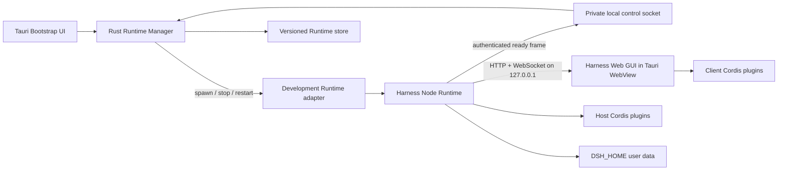
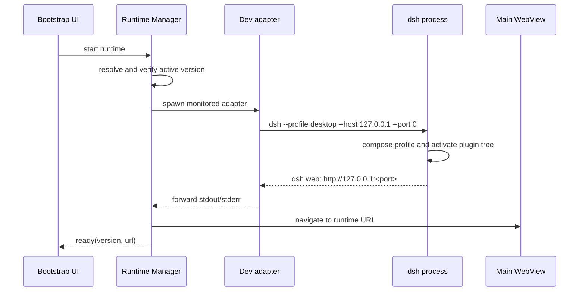

# harndock 总体架构

## 目标

harndock 为 DeepSeek Harness 提供可安装、可更新、可恢复的桌面应用。产品应完整保留 Harness 的 profile、bundle、Host plugin 和 Client plugin 机制，同时避免维护 Harness 核心代码的长期 fork。

首个可交付版本必须做到：启动本地 Harness Runtime、显示其 Web GUI、保留流式对话和插件加载、可靠终止子进程，并在 Runtime 无法启动时提供可操作的恢复界面。

## 非目标

- 不用 Rust 重写 Harness Host。
- 不在 Tauri 内重新实现 Session、Agent、Tool 或 LLM 协议。
- 不复制 Harness React 页面到 harndock。
- 不让用户设备通过 `git pull` 或源码构建完成产品更新。
- 第一阶段不实现插件市场、远程访问和多用户认证。

## 系统关系



## 组件职责

| 组件 | 负责 | 不负责 |
|---|---|---|
| Tauri Bootstrap UI | 启动、安装、更新、错误和恢复状态 | 对话业务与插件页面 |
| Rust Runtime Manager | Runtime 发现、校验、进程生命周期、日志、更新与回滚 | Agent 和插件业务逻辑 |
| Harness Runtime | Profile 组合、Host 服务、会话、模型、工具、持久化和 Web 服务 | 桌面安装器与窗口生命周期 |
| Harness Web GUI | 对话、设置、插件化 UI 和流式状态 | Runtime 安装与版本切换 |
| desktop bundle | 桌面 profile 的配置组合 | 修改 Harness 核心包 |
| desktop client plugin | 可选的桌面专属 UI 集成 | 通用 UI 的重复实现 |

## 工程目录

目标目录如下：

```text
harndock/
├── apps/
│   └── desktop/
│       ├── src/                         # 启动与恢复界面
│       ├── src-tauri/
│       │   ├── src/
│       │   │   ├── runtime/
│       │   │   │   ├── mod.rs          # P1 状态、进程、日志和窄 commands
│       │   │   │   ├── readiness.rs    # 回环就绪 URL 校验
│       │   │   │   └── store.rs        # P3 版本目录与 current.json 原子指针
│       │   │   └── lib.rs
│       │   ├── capabilities/
│       │   ├── Cargo.toml
│       │   └── tauri.conf.json
│       ├── index.html
│       ├── package.json
│       └── vite.config.ts
├── packages/
│   ├── desktop-bundle/                  # Harness profile bundle
│   └── client-desktop/                  # 可选 Client Cordis plugin
├── runtime/
│   ├── harness.lock.json                # 上游版本锁
│   ├── manifest.schema.json             # Runtime artifact 内部清单
│   ├── control-protocol.schema.json     # 生产就绪与固定设置动作协议
│   └── README.md                        # archive 与兼容性契约
├── scripts/
│   ├── build-harness-runtime.mjs        # P3 Runtime artifact 构建器
│   ├── dev-harness-runtime.mjs          # 开发态父进程监护与信号转发
│   ├── verify-harness-runtime.mjs       # P3 artifact 独立探测
│   └── verify-runtime-contract.mjs
├── vendor/
│   └── deepseek-harness/                # Git submodule，只读上游
├── docs/
├── package.json
└── pnpm-workspace.yaml
```

根工程使用 pnpm workspace。Tauri CLI 作为 `apps/desktop` 的开发依赖固定版本，不依赖全局 `cargo-tauri`。Rust workspace 可在出现第二个 crate 后再引入，首版保持单一 `src-tauri` crate。

## 启动流程

Harness 已支持 `--port 0`，由操作系统选择空闲端口。开发源码模式继续读取 Loader 插件树完成后输出的 URL 行；生产 Runtime 使用 P3 控制协议，不把人类日志当作机器接口。



生产模式由 Shell 在私有目录创建 Unix socket 和 256-bit nonce，并通过环境变量交给 desktop profile 中的 `@harndock/runtime-bridge`。bridge 等待整个 Loader 树成功 settlement，发送一条受 schema 约束的 NDJSON `ready` 帧。Shell 验证 nonce、Runtime metadata 和严格回环 URL 后才导航 WebView；生产模式不得回退到 `dsh web:` 日志解析。

正式实现应把状态建模为有限状态机：

```text
missing -> installing -> stopped -> starting -> ready -> stopping -> stopped
                               \-> failed <-/       \-> crashed
```

任何时刻只允许一个受管 Runtime 进程。重复启动、应用退出和更新切换都必须经过同一个状态机，不能从 Tauri command 直接执行任意子进程。

开发适配器不实现 Harness 业务逻辑，只转发 stdout/stderr 和终止信号，并监视 Tauri 父 PID。即使开发构建器强制替换宿主、来不及触发退出事件，适配器也会终止 Harness，避免遗留监听端口。生产 Runtime 在 P3 中改用打包后的固定 Node 和 dsh 入口。

## WebView 策略

Tauri 内置页面只承载 Bootstrap UI。Runtime 就绪后，主窗口导航到本地 Harness URL。Harness 页面默认不获得通用 Tauri command、shell 或文件系统权限。

Runtime 崩溃时由 Rust 端检测子进程退出，销毁或重新导航主窗口到内置恢复页。不要依赖已经失联的 Harness 页面主动报告故障。

第一阶段复用 Harness 已有的目录选择、打开路径和配置 API。只有现有 Host API 无法覆盖的桌面能力，才通过窄范围 Tauri command 或新的 Harness capability 接入。

## Harness 与产品代码的关系

`vendor/deepseek-harness` 固定上游 commit，禁止直接提交产品修改。上游更新通过更新 submodule 指针进入评审和 CI。

桌面 profile 的产品层由 `packages/desktop-bundle` 提供。P2 版本只插入 harndock 自己的 Client plugin 行，不复制 `dsh-base` 或 `dsh-web-app` 的完整配置。Client plugin 仍由 Harness 扫描 `dsh.client` manifest、生成 `window.__DSH_BOOT__`，再由浏览器 Cordis Loader 加载和管理生命周期；它不是 Tauri Bootstrap 前端的一部分。P3 artifact 契约额外预留 `@harndock/runtime-bridge` Host plugin，后续实现结构化就绪，不向 WebView 增加原生权限。

`scripts/prepare-desktop-profile.mjs` 使用 Harness 自己的 `dsh plugin --profile desktop add` 安装产品包，再以结构化 JSON 修改把产品层固定为以下顺序：

```text
@deepseek-ai/dsh-base
@deepseek-ai/dsh-web-app
@harndock/desktop-bundle
第三方 bundles...
```

准备器只维护这三个产品层的相对位置，保留第三方 bundle 的原始顺序。Runtime Manager 启动 `desktop` profile；禁用或卸载产品 bundle 后，前两个上游层仍可独立提供基础 Web GUI。

## 插件类型

| 类型 | 运行位置 | 用途 | 信任级别 |
|---|---|---|---|
| Harness Host plugin | Node Runtime | 模型、工具、存储、策略和 Host API | 本机可执行代码 |
| Harness Client plugin | WebView | 页面、slot、设置和展示 | 页面内可执行代码 |
| Tauri plugin | Rust/Tauri | 窗口、更新、通知等原生能力 | 桌面宿主代码 |

三类插件不能混用同一安装或权限模型。安装 Harness Host plugin 等同于允许本机执行代码；Agent 工具 sandbox 不限制插件自身。因此插件市场必须晚于签名、来源、权限提示和失败回滚机制。

## 安全要求

1. Harness 只绑定 `127.0.0.1`，不启用 `0.0.0.0`。
2. WebView 不暴露通用进程、shell、路径或文件读写 command。
3. Runtime artifact 必须校验签名和 SHA-256 后才能安装。
4. 日志不得写入 API key、环境变量完整快照或凭据文件内容。
5. Runtime 和用户数据使用不同目录；更新不能覆盖 `DSH_HOME`。
6. 第三方插件失败不能触发自动删除用户数据。
7. Tauri、Runtime 和插件错误分别标记来源，恢复页保留诊断日志位置。

## 开发与生产差异

| 项目 | 开发 | 生产 |
|---|---|---|
| Harness 来源 | submodule 源码 checkout | 经过 CI 构建的 Runtime artifact |
| 启动命令 | Node 监护适配器 + Harness TypeScript 源码入口 | artifact 内 Node + `@deepseek-ai/dsh/lib/bin.js` |
| 插件管理 | 开发机 pnpm | artifact 内 pnpm，由内置 Node 执行 |
| 就绪信号 | `dsh web:` stdout 行 | 私有 Unix socket 的 schema 化 ready 帧 |
| Web 资源 | Harness 开发构建 | Runtime 自带的匹配版本资源 |
| 更新 | 手动移动上游 commit | 签名清单与原子版本切换 |
| 日志 | 终端和应用日志 | 应用数据目录中的轮转日志 |

## 架构约束

- Web Client 必须由当前 Host Runtime 提供，避免 Host/Client 版本错配。
- Tauri 不导入 Harness 内部 TypeScript 模块。
- harndock 的 Harness 插件只能依赖公开包入口和 profile 扩展点。
- Runtime Manager 不解析 Session 或插件业务数据。
- 用户数据格式不作为 Runtime Manager 的内部实现细节；兼容性判断由 Runtime 清单和启动探测共同决定。
