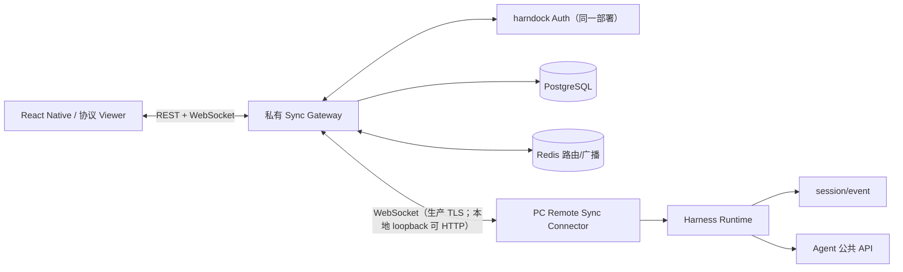

# 移动端多端同步与远程控制功能开发文档

版本：0.7（Mobile UI 架构重排）
状态：基础服务、Desktop、Gateway Web、同步链路与 Mobile 原型已完成；当前优先实施 RN UI 架构、Auth 和 MP-01–MP-05
更新时间：2026-08-24

## 1. 设计原则与边界

1. **PC 是执行源**：模型调用、Agent、Tool、文件、审批和 Session 生命周期只在 PC Harness Runtime 内发生。
2. **Gateway 是协调层**：Gateway 只做身份适配、设备、连接、事件镜像、命令排队、广播和审计。
3. **事件是真相**：客户端由 Session event stream 投影状态；命令状态不能替代真实事件。
4. **命令不写事件日志**：移动端提交的是带幂等标识的意图，不能直接 append Session event。
5. **至少一次投递**：通过游标、ack、幂等键、持久化和补发实现恢复。
6. **公共协议与私有实现分离**：公开包只有 schema、类型、错误码、测试向量和客户端边界；数据库迁移、路由实现和生产配置留在私有仓库。
7. **安全边界后端优先**：客户端 UI 只提供体验，不承担授权；Gateway 和 Connector 都要重新校验。

### 1.1 Gateway origin、Admin origin 与客户端配置

Gateway API/WS 与浏览器管理端使用独立入口：

```text
生产 Gateway：  https://sync.example.test
生产 Admin：    https://admin.sync.example.test
本地 Gateway：  http://127.0.0.1:7019  # 仅显式开发配置、仅 loopback
本地 Admin：    http://127.0.0.1:7018
```

客户端不得把 `/v1/sessions`、`/v1/stream` 或 `/v1/ws` 作为用户输入的 Gateway URL。各客户端从 origin 派生端点：

| 客户端 | 用户配置 | 派生端点 | 凭据 |
| --- | --- | --- | --- |
| Desktop | Gateway origin + pairing code | `/v1/pairings/exchange`、`wss://`/`ws://` `/v1/ws` | Ed25519 私钥签名注册 |
| Mobile | Gateway origin + harndock Auth/开发 token | `/v1/sessions`、`wss://`/`ws://` `/v1/stream` | Bearer access token |
| Gateway Web Console | Admin origin | 同源代理 `/v1/me`、`/v1/devices`、`/v1/runtimes`、`/v1/tokens`、诊断接口 | HttpOnly refresh cookie + 内存 access token |

Desktop 的配置入口属于 Tauri Remote Sync 设置，不属于 Harness Runtime 的业务配置。配对成功后，Desktop 将 origin 派生出的 WebSocket URL 和设备身份写入受保护的本地配置；PC 私钥进入系统 Keychain。Mobile 将短期 access token 写入 `expo-secure-store`，不写入 SQLite。

生产构建只允许 HTTPS。为支持本地 Docker/BlueStacks，客户端可以通过显式开发配置允许 HTTP，但只允许 loopback Gateway；HTTP bearer token 不得用于公网或共享网络。

### 1.2 harndock Auth 账号与身份会话

harndock Auth 是私有部署内的第一方账号服务，由 Gateway 提供接口；原生客户端直连 Gateway origin，浏览器通过 Admin origin 的同源代理访问。它负责账号生命周期和会话，Gateway 负责 principal、设备和同步授权：

```text
管理员登录页
  → harndock Auth
  → access/refresh session
  → Gateway /v1/me
  → upsert accounts
  → 注册当前 Device / 获取 token
```

Gateway 不接受客户端直接提交 `accountId`，也不开放注册。`/v1/auth/login`、`/v1/auth/refresh` 和 `/v1/auth/logout` 由 harndock Auth 提供；首次启动从 `GATEWAY_ADMIN_USERNAME`、`GATEWAY_ADMIN_PASSWORD` 初始化唯一管理员，数据库已有管理员后环境变量不再覆盖。密码和 refresh token 只在 Auth 安全边界内处理。

## 2. 仓库与模块

```text
公开仓库 harndock/
├── packages/sync-protocol/       # schema、类型、编解码、错误码、测试向量
├── packages/remote-sync/         # Harness Host plugin、PC uplink、本地 outbox
├── apps/mobile/                  # React Native + TypeScript 客户端
└── docs/mobile-sync/              # 需求、开发、实施、原型

私有仓库 harndock-sync-server/
├── src/server.ts                 # Fastify Gateway 入口
├── src/app.ts                    # REST/WebSocket 路由组合
├── src/*-repository.ts           # PostgreSQL 数据访问边界
├── src/worker.ts                 # 异步命令/维护 Worker
├── src/persistence/migrations/   # 数据库迁移
└── deploy/                       # Dockerfile、Compose、部署说明
```

公开 `@harndock/sync-protocol` 应以版本化包发布。服务端生产构建不能复制 `harndock` 源码；当前本地开发阶段可以使用相邻仓库的 file dependency，发布前必须切换到 registry 版本。

## 3. 系统架构



### 3.1 PC Connector

Connector 作为 desktop profile 的外部 Host plugin 加载，负责：

- 订阅 `session/event`、Session 生命周期和审批事件。
- 维护出站 WebSocket、挑战签名、心跳、指数退避、发送队列和连接状态。
- 启动时枚举 Session snapshot；重连时用 `listSnapshots()` 和 `readFrom()` 校正云端游标缺口。
- 将 `session.prompt`、`session.cancel`、`approval.respond` 映射到 Harness 公共控制适配器。
- 对目标 Runtime、Session、命令期限、审批状态和本地能力做二次校验。
- 本地 outbox 只保留未 ack 帧和游标，不复制完整 Session 数据库。
- 不暴露本地 Harness HTTP、文件系统、Shell 或通用 Tauri command。

事件发布和本地持久化存在 write-behind 窗口，因此 Connector 可以低延迟上送，但启动/重连必须以本地 persistence 前缀校正，不能把云端镜像当作 PC 日志替代品。

### 3.2 Gateway

- Fastify：REST、鉴权、健康检查和 WebSocket 升级。
- PostgreSQL：设备、Runtime、Session header/seq、事件镜像、命令、审批、审计和迁移记录。
- Redis：连接定位、在线状态、短期广播和竞争协调；丢失后可重建，不能作为事件真相。
- Worker：命令重试/回收、过期数据清理、事件压缩和未来通知任务。
- Gateway 只在 PostgreSQL 事务提交后向 Viewer 广播事件。
- `health/live` 只判断进程；`health/ready` 判断 PostgreSQL/Redis 是否可用。

当前服务端入口实际为 `src/server.ts` + `src/app.ts`，不是规划中的 `apps/gateway` 目录；目录结构以后可重构，但路由、协议和部署契约不变。

### 3.3 客户端

React Native + TypeScript 移动端按六层拆分：

1. `services/transport`：REST、Viewer stream、重连、认证 header、错误映射；不持有 React 页面状态。
2. `services/storage`：SecureStore 安全会话、SQLite 安全投影、Session `lastSeq`、最小命令状态和连接诊断。
3. `features/projection`：快照/事件 reducer、缺口检测、去重、审批和命令终态。
4. `features/*`：auth、sessions、conversation、commands、diagnostics 的业务状态和 hooks；screen 不直接查询 SQLite 或轮询 command API。
5. `components/theme`：Harness 同源 token 和无业务基础组件，包括 Header、Button、Banner、Card、Sheet、Status、Composer 与 ApprovalPanel。
6. `app/navigation` 与 `screens`：AuthGate、MP-01 登录/连接、MP-02 Session 首页、MP-03/MP-04 Conversation/审批和 MP-05 设置/诊断摘要。

启动顺序：受控 Splash/AuthGate → 安全会话恢复 → 本地 Session 投影 → 目录/快照 → `afterSeq` 历史 → 实时订阅。已登录且最近 Session 仍授权时可以恢复 Conversation，否则进入 Session 首页。UI 不直接操作 transport 或数据库。

`T4-00` 已把 `apps/mobile/src/App.tsx` 缩减为最小入口，并把 navigation/screens/features/components/theme/services 分层落地；screen 不再直接操作 SQLite、Viewer stream 或 command API。`T4-03` 已补 Gateway origin 的 SecureStore 恢复、规范化、生产 HTTPS/开发 loopback HTTP 校验，以及 origin 变更时旧 token 清理。`T4-04` 进一步按服务端 Auth 契约保存 schema v1 会话：access/refresh token 分项进入 SecureStore 双槽，metadata 只含 origin、过期时间、account/device/scope，active pointer 最后提交；轮换失败不会读取混合代，清理先删除 pointer 再尽力清空两槽和旧开发 token。`T4-01` 已在导航之前接入受控 Splash/AuthGate：有效 access 先经 `/v1/me` 校验，过期或 401 时通过 `/v1/auth/refresh` 单次轮换并先持久化再开放受保护导航；refresh 失效、logout、REST 401 和 Viewer `device_revoked` 统一清理并回到公开导航，瞬时网络故障停留在可重试恢复页。`T4-02` 已用 MP-01 替换 Pairing 工程页：页面提交 Gateway origin、管理员账号和仅存在于组件内存的密码，并使用 SecureStore 中稳定的随机 Mobile installation ID 调用 `/v1/auth/login`；登录结果安全保存后才激活受保护导航，保存失败会尽力远端 logout。页面无注册入口；legacy token 的渲染和启动恢复都要求 `__DEV__` 与 `EXPO_PUBLIC_MOBILE_DEBUG_TOKEN=true` 双门禁，生产构建会清除残留 legacy token。`T4-05` 已用 MP-02 替换设备库存优先首页：Viewer 内部继续遍历 Gateway 不透明游标分页，页面只消费已合并的 SQLite projection；待审批/等待 Session 与最近活动分组稳定排序，PC/Gateway 仅显示紧凑摘要，整行进入 Conversation。Conversation 左上角打开可复用 Session 抽屉，抽屉打开时系统返回先关闭抽屉，切换 Session 使用 replace 避免堆积页面。`T4-06` 已把聚合消息与非消息事件按 seq 合并为唯一 EventTimeline：assistant chunk 只通过聚合消息显示一次，工具卡仅可展开固定安全说明，命令只显示类型/状态，未知事件只显示类型/时间/seq；工具参数、结果、命令 payload 和未知 payload 不进入展示模型。用户离开底部后新内容不抢滚动位置，并显示“回到底部”；切换 Session 时先清空旧 projection、command 和草稿，避免跨 Session 闪现。`T4-07` 已在 EventTimeline 下方加入键盘安全区常驻 Composer，并把 prompt/cancel 的 submitting、queued、executing、stopping、stale、unknown、offline 和失败状态收敛为纯展示模型。命令提交结果不确定时复用同一 commandId 依赖服务端幂等，Gateway 明确拒绝或过期后才以最新 seq 新建命令；unknown 不自动重放，cancel completed 也要等待真实 Session 终态事件才解除“停止中”。本地 SQLite 继续只保存命令元数据，不保存 prompt 或 payload。`T4-08` 已让未决审批完全接管 Composer 区域：ApprovalPanel 实现冻结的组件契约，只接收 approvalId、toolName 和脱敏状态，不读取事件 payload。同步 submission lock 在任何 await 前占用 approvalId，queued/executing/completed 均保持锁定，只有真实 projection 清除或切换审批后释放；`approval_already_decided` 显示其他设备已处理并等待事件同步，不能自动重提。

Gateway Web 管理页是独立的浏览器应用，负责管理员登录、账号摘要、设备与 Runtime、access token、连接诊断和账号隐私。它不提供注册、跨账号运维、角色管理或全局设备查询。

### 3.4 账号、设备、Runtime 与凭据边界

- `account` 是 harndock Auth principal 对应的租户边界；Gateway 从认证结果推导 `accountId`，不接受客户端自报账号。
- `device` 是一个客户端安装实例，拥有稳定 `deviceId` 和公钥。Desktop、Mobile、Browser 都可以是 Device，但设备类型不等于权限角色。
- `runtime` 是 PC Harness 执行实例，必须绑定一个 PC Device；Session 绑定 Runtime，不绑定 access token。
- `access_token` 是绑定到 Device 的短期能力凭据，scope 至少包括 `session.read`，控制操作额外需要 `session.control`。
- `pairing_code` 是一次性、短期的 PC Device 创建凭据；兑换后立即消费，不能作为登录 token 或长期配置。
- 撤销 Device 会关闭该设备的连接并失效其全部 access token；撤销单个 access token 不删除 Device 密钥，也不影响同设备其他 token。

本地敏感数据边界：

| 位置 | 允许保存 | 禁止保存 |
| --- | --- | --- |
| Desktop `remote-sync/config.json` | Gateway WS URL、Account/Device/Runtime ID、公钥、outbox 路径 | PC 私钥、access token、pairing code 原文 |
| Desktop 系统 Keychain | PC Device 私钥 | 完整事件或普通日志 |
| Mobile SecureStore | Gateway origin、access/refresh token、会话版本和当前 Device 的最小标识 | 密码、Session payload、完整命令 payload |
| Gateway PostgreSQL | token digest、scope、过期/撤销/使用时间、token hint | 原始 access token、PC 私钥 |

## 4. 协议契约

所有帧使用 JSON envelope；`frameId` 用于传输去重，`sessionId + seq` 用于 Session 事件顺序。

```json
{
  "protocolVersion": 1,
  "frameId": "frame_01J...",
  "kind": "session.event",
  "accountId": "acct_123",
  "deviceId": "dev_phone_a",
  "runtimeId": "runtime_mac_01",
  "sessionId": "session_abc",
  "sentAt": "2026-08-20T09:30:00.000Z",
  "payload": {}
}
```

### 4.1 PC WebSocket 握手

```text
client.hello → server.hello → pc.challenge → pc.register → pc.registered
                              ↘ error
pc.heartbeat ↔ server.heartbeat
pc.snapshot / pc.event → event.ack
command.submit ← command.status
```

PC 的 `pc.register` 使用设备私钥对固定 domain-separated 字符串签名，包含 challenge、nonce、account、device、runtime。Gateway 检查设备撤销、Runtime 归属、签名和协议版本后才接受事件。

### 4.2 Viewer stream

1. `GET /v1/sessions` 读取目录。
2. `GET /v1/sessions/:sessionId` 读取快照和 Runtime 在线状态。
3. `GET /v1/sessions/:sessionId/events?afterSeq=N` 读取历史。
4. 连接 `GET /v1/stream`，发送 `client.subscribe` 或 `cursor.resume`。
5. 超过广播窗口返回 `cursor_gap`，客户端暂停投影，走 REST 补发后再恢复订阅。

服务端从 token principal 推导 account，拒绝客户端自报账号。Viewer 使用 `session.read` scope；控制接口额外要求 `session.control`。

### 4.3 Session 快照与事件

```json
{
  "kind": "session.snapshot",
  "sessionId": "session_abc",
  "header": {
    "title": "修复 Runtime 启动问题",
    "cwdLabel": "harndock",
    "createdAt": 1786959000000,
    "parentSessionId": null
  },
  "projection": {
    "status": "running",
    "lastSeq": 128,
    "lastActivityAt": 1786959123456,
    "unresolvedApproval": null
  }
}
```

事件只保证顺序和必要元数据；未知 `eventType` 原样保存并以安全占位渲染。工具参数、结果、环境变量和本机路径必须根据脱敏策略裁剪。

### 4.4 命令与状态机

```text
received → authorized → queued → executing → completed
                    ↘ rejected       ↘ expired
                         ↘ unknown（PC 断线且结果不可确认）
```

```json
{
  "kind": "command.submit",
  "commandId": "cmd_01J...",
  "sessionId": "session_abc",
  "baseSeq": 128,
  "commandType": "session.prompt",
  "payload": { "contentBlocks": [{ "type": "text", "text": "继续检查" }] },
  "expiresAt": "2026-08-20T09:31:00.000Z"
}
```

- 命令唯一键：`accountId + deviceId + commandId`。
- 事件唯一键：`runtimeId + sessionId + seq`。
- 审批唯一键：`runtimeId + sessionId + approvalId`。
- 重复命令返回原状态，不二次转发。
- `baseSeq` 不匹配返回 `stale_state`，客户端刷新后由用户决定是否重试。
- 未确认普通命令不自动重放；客户端显示 `unknown`。
- 同一 Session 普通命令只有一个 `executing`；cancel/审批走高优先级路径，但仍需审计和二次校验。

## 5. REST 与 WebSocket API

### 5.1 当前已实现的 Gateway 端点

| 方法 | 路径 | scope/用途 |
| --- | --- | --- |
| GET | `/health/live` | 存活，不依赖外部服务 |
| GET | `/health/ready` | PostgreSQL/Redis 就绪 |
| POST | `/v1/pairings/exchange` | 一次性配对码兑换；不要求登录但受配对码约束 |
| DELETE | `/v1/devices/:deviceId` | 当前账号撤销设备 |
| GET | `/v1/sessions` | `session.read`，游标分页目录 |
| GET | `/v1/sessions/:sessionId` | `session.read`，快照和 Runtime 状态 |
| GET | `/v1/sessions/:sessionId/events` | `session.read`，`afterSeq` 历史 |
| POST | `/v1/sessions/:sessionId/commands` | `session.control`，提交 prompt/cancel/approval |
| GET | `/v1/commands/:commandId` | 当前设备查询命令状态 |
| GET | `/v1/stream` | `session.read`，Viewer stream |
| GET | `/v1/ws` | PC challenge/register/event uplink |

管理员登录、refresh 和 logout 由 harndock Auth 负责。管理员凭据由环境变量首次初始化，之后通过 `PUT /v1/admin/credentials` 修改。harndock Auth 由 Gateway 提供；原生客户端使用 Gateway origin，Web 使用 Admin origin 的同源代理。

### 5.2 已实现的账号、设备与凭据端点

| 方法 | 路径 | 用途 |
| --- | --- | --- |
| GET | `/v1/me` | 当前账号、当前 Device、scope 和会话摘要 |
| POST | `/v1/auth/login` | 管理员登录并返回短期 access token 与 refresh session |
| POST | `/v1/auth/refresh` | 刷新会话并轮换短期 access token |
| POST | `/v1/auth/logout` | 撤销当前 refresh session 和 access token |
| PUT | `/v1/admin/credentials` | 使用当前管理员 Basic Auth 修改账号密码并撤销全部旧会话 |
| GET | `/v1/tokens` | 当前账号 token 元数据；不返回原始 token |
| POST | `/v1/tokens` | 为当前账号下的有效 Device 签发短期 token；原始 token 只返回一次 |
| POST | `/v1/tokens/:tokenId/revoke` | 撤销单个 token |
| GET | `/v1/devices` | 当前账号设备列表、平台、最近在线和撤销状态 |
| GET | `/v1/runtimes` | 当前账号 Runtime、PC 在线状态、心跳和延迟 |
| POST | `/v1/devices/:deviceId/rotate` | 设备凭证轮换；是否纳入 V1 由安全评审决定 |

这些端点必须复用现有 principal、scope、撤销和审计中间件；服务端不应为了适配原型而新增客户端自报 `accountId` 的参数。`POST /v1/tokens` 的请求只能引用当前账号下的有效 Device，scope 和 TTL 必须由服务端限制；响应中的原始 token 不得写日志。

### 5.3 账号与连接接口边界

T2-10 需在正式 E2E 前新增以下当前账号自助接口：

| 方法 | 路径 | 用途 |
| --- | --- | --- |
| POST | `/v1/pairings` | 为 Bearer principal 当前账号创建 pairing code；原文只在 201 响应返回一次 |
| GET | `/v1/pairings` | 返回当前账号 pairing 元数据和 active/consumed/expired/revoked 状态，不返回原文或 digest |
| POST | `/v1/pairings/:pairingId/revoke` | 撤销当前账号尚未消费的 pairing code；幂等且写审计 |

pairing 记录需增加不可猜测的 `pairingId` 和 `revokedAt`；所有管理查询从 principal 推导 `accountId`，不接受客户端自报账号。部署 CLI 可继续直接签发用于恢复，但不得成为 Web/ Desktop 普通用户流程。Web 创建结果只在内存中一次性展示，关闭后不可恢复；列表、日志和诊断只使用 `pairingId` 与状态元数据。

| 能力 | 负责方 | 客户端行为 |
| --- | --- | --- |
| 登录/refresh/logout | harndock Auth | 不开放注册；Mobile 使用 Gateway origin，Web 使用 Admin origin 的同源代理；密码不持久化，Web refresh 凭据使用 HttpOnly/SameSite cookie，不进入普通 Web Storage |
| 当前账号摘要 | Gateway `/v1/me` | 展示账号、当前 Device、scope 和过期时间 |
| PC Device 创建 | Gateway pairing exchange | Desktop 提交配对码和公钥 |
| Mobile Device 注册 | harndock Auth + Gateway | 首次登录后注册安装实例并签发短期 token |
| Gateway origin | Desktop/Mobile 本地设置 | 只保存 origin，客户端派生 REST/WS 路径 |

### 5.3.1 Gateway Admin Web 生产入口

生产入口固定为独立 Admin origin；本地端口为 `7018`，Gateway API/WS 为 `7019`：

- Admin 的 `GET /`、`/login`、`/devices`、`/pairings`、`/tokens`、`/diagnostics`、`/account` 返回 Gateway Console SPA；直接刷新必须可恢复路由；`/register` 返回 404。
- Admin 将 `/v1/*`、`/health/*` 同源代理到 Gateway，不代理 `/v1/ws` 和 `/v1/stream`；未知 API 路径或错误响应不得被 SPA fallback 吞掉。
- Console 静态产物必须进入正式 Docker/反向代理发布物；Gateway `7019` 不再提供 SPA 路由，根路径应为 404。
- 浏览器始终使用 Admin origin，不把 CORS 作为默认生产依赖；Admin origin 输入默认等于 `window.location.origin`。
- 本地开发使用 `http://localhost:7018` 代理到 `127.0.0.1:7019`；正式镜像验收必须分别覆盖 Admin `7018` 和 Gateway `7019`。

### 5.3.2 Desktop 配置入口

Desktop 配置页仍由 Tauri 本地壳承载，不修改上游 Harness 页面源码。入口分三层：

1. 未配对首次启动不自动掠过配置页；用户选择配置 Gateway，或明确选择继续本地模式。
2. `@harndock/client-desktop` 在 Harness 页面提供常驻“Gateway & Remote Sync”入口，不依赖用户记住原生菜单。
3. 原生应用菜单 `Remote Sync Settings...` 与 `Cmd/Ctrl+,` 保留为跨页面兜底。

Harness 页面运行在本地 Runtime origin，不能因此获得通用 Tauri IPC、Shell 或文件权限。浏览器插件只向同源 `/harndock/desktop/settings` 发送固定 POST；host bridge 校验 origin 和动作头后，通过带 256-bit nonce、固定 `showSettings` 消息类型和 8 KiB 上限的 Unix 控制帧请求本地壳返回配置页，不得扩展成任意命令通道。入口、返回 Harness、首次引导和 macOS/Windows/Linux 菜单行为都需要自动化或打包 smoke。

### 5.4 统一错误响应

```json
{
  "error": {
    "code": "stale_state",
    "message": "session state is newer than the submitted baseSeq",
    "retryable": false,
    "requestId": "req_01J..."
  }
}
```

客户端必须为 `unauthorized`、`forbidden`、`device_revoked`、`cursor_gap`、`stale_state`、`duplicate_command`、`runtime_offline`、`command_expired`、`approval_already_decided` 和 `rate_limited` 提供稳定映射。

## 6. 数据模型与持久化

| 实体 | 关键字段 | 约束 |
| --- | --- | --- |
| account | accountId、authSubject、status、createdAt | 身份由 harndock Auth 负责，Gateway 不管理密码 |
| device | accountId、deviceId、publicKeyHash、name、platform、revokedAt、lastSeenAt | 公钥绑定、撤销后不可恢复 |
| runtime | accountId、deviceId、runtimeId、status、lastHeartbeatAt、lastSeq | 一个账号 V1 仅一个活动 Runtime |
| access_token | id、accountId、deviceId、label、tokenHint、scopes、expiresAt、revokedAt、lastUsedAt、createdAt | 只存 digest；原始 token 只在签发响应中出现一次 |
| pairing_code | pairingId、accountId、codeDigest、expiresAt、consumedAt、revokedAt、pairedDeviceId | 一次性消费；不存原文；管理接口只返回 ID 和状态元数据 |
| session | accountId、runtimeId、sessionId、title、cwdLabel、status、lastSeq、updatedAt | `(accountId, sessionId)` 唯一 |
| session_event | runtimeId、sessionId、seq、eventType、safePayload、receivedAt | `(runtimeId, sessionId, seq)` 唯一 |
| command | accountId、deviceId、commandId、sessionId、type、baseSeq、status、expiresAt、failureCode | `(accountId, deviceId, commandId)` 唯一 |
| approval | runtimeId、sessionId、approvalId、status、decidedBy、decidedAt | first-wins 原子更新 |
| audit | accountId、actorDeviceId、action、target、result、requestId、createdAt | 禁止完整 token/payload |

事件正文按部署保留策略清理，默认 30 天只是待评审建议，不应在客户端硬编码。Redis 不存唯一真相；事件、命令终态和审计必须从 PostgreSQL 可恢复。

## 7. 客户端投影与 UI 实现

### 7.1 Session 投影

Reducer 只接受：

1. 初始 snapshot：设置 `lastSeq`；空 Session 使用 `-1`，因为 Harness 事件从 `seq=0` 开始。
2. `seq === lastSeq + 1`：应用并推进。
3. `seq <= lastSeq`：丢弃重复。
4. `seq > lastSeq + 1`：进入 gap，暂停显示增量并触发 REST 补发。

补发完成后按序批量应用，流式片段用 50ms 窗口合并渲染，避免每帧重绘完整列表。

### 7.2 安全摘要

- 用户/助手消息：限制长度和文本类型。
- 工具调用：展示工具名、操作类型、审批状态和必要范围。
- 工具参数/结果：默认不展开；必要时只展示脱敏摘要。
- 未知事件：展示事件类型和时间，保留序号，不展示未知 payload。
- 命令 payload：不写入普通本地缓存，命令恢复只查询 `commandId`。

### 7.3 页面实现对应

| 页面 | 主要组件 | 依赖 |
| --- | --- | --- |
| P-01 / MP-01 | Web Auth/Connection；RN AuthGate/LoginScreen/ConnectionForm；Desktop Remote Sync Settings | harndock Auth、Gateway origin、SecureStore、pairing exchange；开发 token 仅 debug 构建 |
| P-02 / MP-02 | SessionHome、NeedsAttentionSection、RecentSessions、SessionDrawer、EmptyState | sessions REST、SQLite projection、Runtime 摘要 |
| P-03 / MP-03 | ConversationScreen、SessionHeader、EventTimeline、ToolSummary、Composer、CommandStatus | snapshot/events/stream/commands |
| P-03 / MP-04 | ApprovalPanel、ApprovalActions、AlreadyDecidedState | approval projection、command submit、真实 resolved event |
| P-05/P-06 / MP-05 | MobileSettings、CurrentAccount、GatewaySummary、RuntimeSummary、SyncDiagnostics、SignOut | Auth session、`/v1/me`、Runtime/transport diagnostics；设置页复用受保护导航栈的单一目录/ViewerSync Provider，只消费脱敏摘要 |

T4-10 质量门补充：登录和命令输入字段必须有稳定读屏标签；设置行以一个可读摘要暴露，避免状态点和正文重复聚焦；Modal 抽屉通过 `onRequestClose` 优先关闭；所有按钮/图标按钮保持至少 44dp 触控尺寸；页面滚动区域在键盘出现时使用 `keyboardShouldPersistTaps="handled"`。
| P-04 | Web DeviceList、RuntimeCard、TokenSummary、RevokeConfirm、PairingHelp | devices/runtimes/tokens REST、撤销级联 |
| P-05 | Web ConnectionCard、CursorCard、RecoveryAction、ErrorTimeline | transport diagnostics |
| P-06 | Web AccountCard、PrivacyNotice、SignOut | harndock Auth、保留策略 |

### 7.4 原型与真实 UI 的关系

两份原型均使用内置 mock 数据和浏览器 DOM，不调用真实 Gateway：

- `prototype.html` 是 Gateway Web/Desktop 综合交互资料，覆盖账号、设备、Runtime、Token、pairing、诊断和 Desktop 配置。
- `mobile-prototype.html` 是 RN Viewer/Controller 的产品基线，覆盖 MP-01–MP-05、Session 抽屉、固定 Composer、审批接管和 online/offline/approval 状态。

原型只证明页面结构、状态文案、交互顺序和响应式方向，不证明协议安全、性能、真实 API 或 React Native 代码已经完成。真实实现复用 `packages/sync-protocol` 和 `apps/mobile/src/sync` 的 transport/projection 能力，但不复用当前 `App.tsx` 的工程验证式页面结构；Harness Web CSS/React 组件也不直接进入 RN bundle，只提取设计 token、信息架构和交互语义。

## 8. 安全设计

- TLS 传输；access token 短期、可撤销；refresh token 只由 harndock Auth 管理。
- Gateway origin 必须经过协议、host、path、query 和 fragment 校验；HTTP 仅允许明确开启的 loopback 开发配置。
- Desktop pairing endpoint 只接受 HTTPS，或 `localhost`/`127.0.0.1`/`::1` 的 HTTP；公网 HTTP 配对直接拒绝。
- PC 私钥进入 macOS Keychain/移动端安全存储；不进入 AsyncStorage、日志或 crash report。
- 统一 middleware 从 token principal 得到 account/device；所有 Session 查询再次校验归属。
- WebSocket 限制 origin/连接空闲超时/帧大小；REST 和命令按设备限流。
- 配对码高熵、短 TTL、单次消费；过期/重放/重复公钥使用统一拒绝文案。
- 命令在 Gateway 和 Connector 双重授权；撤销设备主动关闭现有 WS。
- 日志只记 requestId、actor、target、状态和错误码；不记 token、私钥、完整 prompt、完整路径。

## 9. 可观测性与运维

必须具备：

- 连接数、PC 在线率、WS 重连次数、事件广播延迟、seq 缺口、补发耗时。
- 命令各状态计数、unknown 率、审批超时/冲突、撤销次数。
- Gateway/Worker/Redis/PostgreSQL 健康与迁移版本。
- requestId/correlationId 贯穿 REST → command → PC → event ack。
- 事件、命令、审计保留/删除进度；失败可重试。

Docker 要求：锁定基础镜像 digest、多阶段构建、非 root、只读根文件系统、迁移一次性容器、健康检查、镜像 digest/SBOM、备份与回滚演练。

## 10. 测试方案

| 层级 | 必测内容 |
| --- | --- |
| 协议契约 | schema、错误码、未知事件、版本兼容、合法/非法向量 |
| 单元 | reducer、游标、幂等、权限、队列、审批 first-wins、脱敏 |
| Gateway 集成 | PostgreSQL、Redis、迁移、WS 握手、事件 ack、命令状态、撤销 |
| 身份与凭据 | 唯一管理员首次初始化/凭据修改、PC pairing、token 签发/列表/撤销、过期/设备级级联失效、原始 token 不落日志 |
| Connector | 真实 Harness Session、Runtime 重启、outbox、缺口校正、命令二次授权 |
| 客户端 | MP-01–MP-05、登录/配对、目录、快照、历史、实时、断线、prompt/cancel/approval、设备撤销、软键盘/安全区和系统返回 |
| 原型 smoke | 综合原型 P-01–P-06；Mobile 原型 MP-01–MP-05、online/offline/approval、320/390/768 宽度、DOM ID/按钮可达性 |
| 故障 | Gateway 滚动重启、Redis 清空、DB 恢复、PC 崩溃、网络切换 |
| 性能 | 长连接、事件吞吐、广播 P95、历史首屏、流式合并渲染 |
| 安全 | IDOR、重放、撤销、过期 token、输入大小、日志脱敏、WS origin |

涉及 DB、WS、权限或命令语义的改动必须有 Docker 集成测试，不能只用 mock。

## 11. 兼容与发布

协议变更顺序：先发布向后兼容的 `sync-protocol` 和向量 → Gateway 双读/双版本支持 → Connector/客户端灰度 → 兼容窗口结束后再移除旧版本。公开包、服务端和客户端必须维护版本矩阵。

生产发布必须带镜像 digest、SBOM、迁移版本、变更记录、告警、数据删除手册和回滚条件。不得依赖宿主机 Node.js、源码目录或手工改库。
