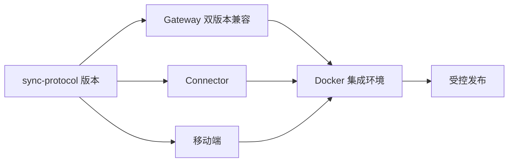

# 移动端多端同步与远程控制实施计划

版本：1.0（Mobile 优先实施）
状态：Gateway Web、Desktop、Mobile 设计基线、MP-01 认证、MP-02 Session 首页、MP-03 Conversation、常驻 Composer、MP-04 审批接管和 MP-05 设置与诊断代码纵切已完成；T4-10 真机视觉质量门已完成，TalkBack/VoiceOver 实际焦点遍历待补；T7-07 已完成 Harness 触发核查但真实 approval 竞争仍待补
更新时间：2026-08-28

## 1. 目标与执行原则

本计划把服务端、PC Connector、React Native Viewer、独立 Web Gateway 管理页、交互原型和发布质量放进同一条验收链。每个里程碑必须有可运行结果、测试命令和明确退出条件；原型可以早于真实 API 并行，但不允许原型引入未批准的 V1 能力。

执行边界：

- PC Runtime 是唯一执行源；Gateway 不执行模型、Shell、文件或 Harness plugin。
- 私有服务端只通过 Docker 镜像部署；公开仓库只包含协议、Connector、客户端和文档。
- V1 一个活动 PC Runtime、多设备 Viewer/Controller；多 PC、租约、附件、推送和商业化后置。
- UI 任务必须回指 `requirements.md` 的 FR/P 编号，API/状态任务必须回指 `development.md`。
- “文档完成”“交互原型完成”“React Native 代码完成”“真实 E2E 完成”是四个独立状态，不得互相替代。
- Mobile 是当前唯一产品开发主线。Gateway Web、Desktop、服务端扩展和发布质量任务只在阻断 Mobile P0、修复安全/数据损坏风险或补齐既定 API 契约时允许插入。

## 2. 当前基线（2026-08-25）

| 工作面 | 当前状态 | 证据/剩余 |
| --- | --- | --- |
| sync-protocol | 功能完成 | schema、类型、向量、兼容策略和测试通过；进入版本发布门 |
| harndock-sync-server Docker | 功能完成 | harndock Auth、PostgreSQL/Redis/Gateway/Worker、迁移、健康、账号/设备/Runtime/token API 已纳入统一 Compose |
| PC Connector | 功能完成 | 配对、签名注册、事件上行、ack、outbox、重连和控制校验已实现 |
| Session 只读同步 | 功能完成 | REST 分页、afterSeq、Viewer stream、移动端投影/SQLite/补发已实现 |
| 远程控制 | 功能完成 | prompt/cancel/approval、队列、串行、first-wins、审计和撤销已实现 |
| harndock Auth | 功能完成 | 唯一管理员环境初始化、登录、refresh、logout、curl 凭据修改、principal 和短期 token 已接入 Gateway；注册已移除 |
| 真实 Harness E2E | 部分完成 | 真实 Session、control adapter、重连和撤销路径已验证；最新 Mobile 上的 approval 与历史补发仍待重跑 |
| Desktop Gateway 配置 | 功能完成 | Remote Sync 设置、origin 校验、重新配对、解除配对、首启门、三条常驻入口、本地/Gateway/远端 Runtime 状态和持续心跳已覆盖；生产 Runtime/profile 单调升级已通过 Release 验收 |
| React Native Viewer 页面 | MP-01 至 MP-04 完成，产品纵切执行中 | Gateway origin、管理员 login、安全会话、AuthGate、Session 首页/抽屉、单一事件时间线、prompt/cancel 命令状态和审批接管已实现；设置仍待纵切 |
| Web Gateway 管理页 | 已完成 | `apps/gateway-console` 已完成无注册 Auth、账号、设备、Runtime、Token、pairing、诊断、15 项自动化和真实 Gateway + Desktop E2E；隔离浏览器当前设备撤销已通过 |
| HTML 原型 | 分载体管理并已评审 | `prototype.html` 保留 Gateway Web/Desktop 综合流程；`mobile-prototype.html` 的 MP-01–MP-05 已于 2026-08-24 评审通过；两者均不作为真实 API 或 RN 代码证明 |
| 生产发布 | 发布门待执行 | 签名、容量、安全、备份恢复、候选镜像和灰度发布属于发布验收，不是功能缺口 |

## 3. 里程碑总览

| 里程碑 | 名称 | 目标 | 状态 |
| --- | --- | --- | --- |
| M0 | 决策冻结与威胁建模 | 冻结 V1、身份、隐私、删除和威胁边界 | 已完成 |
| M1 | 公共协议包 | 公开 schema、类型、错误码和测试向量 | 已完成 |
| M2 | Gateway 与 Docker | 私有服务、迁移、健康、harndock Auth、设备、token 和自助 pairing | 已完成 |
| M3 | PC Connector 事件上行 | PC 配对、签名、事件、outbox、补偿 | 已完成 |
| M4 | 多端只读同步 | Session 目录、历史、实时、SQLite、断线恢复 | 已完成 |
| M5 | 远程控制闭环 | prompt/cancel/approval、队列、审计、撤销 | 服务端/Connector 已完成；Desktop Harness 当前未产生真实 `approval/requested`，Mobile approval E2E 待补 |
| UX1 | 原型与页面基线 | 分离 Web/Desktop 综合原型与 MP-01–MP-05 Mobile 原型，冻结 Harness 同源心智、信息架构、组件和状态 | 已完成（2026-08-24 原型评审通过） |
| UX2 | Mobile 客户端产品化 | RN UI 架构、AuthGate、Session 首页、Conversation、Composer、审批、设置与真实 projection/transport 接入 | 收尾阶段（MP-01 至 MP-05 代码纵切与 T4-10 真机视觉已完成；下一项：T7-07 approval 竞争与屏幕阅读器焦点） |
| UX3 | Web Gateway 管理页 | 独立浏览器管理页接入 harndock Auth 与 Gateway 管理 API | 已完成 |
| M6 | 可靠性、安全与容量 | 故障、安全、指标、压测、备份恢复 | 发布质量门 |
| M7 | 受控发布 | 兼容矩阵、候选镜像、E2E、灰度和回滚 | 发布质量门 |

## 4. 前端/原型工作流（新增正式工作面）

### UX1：原型和文档冻结

任务：

1. 需求文档明确 P-01–P-06、FR-01–FR-24、账号/设备/Runtime/token 边界、Mobile 信息架构、错误文案和 V1 非目标。
2. `prototype.html` 继续覆盖 Gateway Web/Desktop 的认证、连接、设备/Runtime/token、诊断和账号隐私，不再作为 Mobile 产品 UI 依据。
3. `mobile-prototype.html` 独立覆盖 MP-01 登录与连接、MP-02 Session 首页、MP-03 Conversation、MP-04 审批接管和 MP-05 设置与诊断。
4. Mobile 原型覆盖 online、offline、approval、loading、empty、cursor gap、command unknown、already decided 和 revoked；设备库存不先于 Session 出现在主流程。
5. 冻结 Harness 到 Mobile 的映射：sidebar → Session 首页/抽屉，center → 全屏 Conversation，details → sheet/详情页，resident Composer → 键盘安全区固定输入，approval → Composer 接管。
6. 冻结第一版 design token：neutral-bluish 背景/文字/边框、DeepSeek blue、green/amber/red 状态、间距、圆角、字体层级、44×44 触控目标和动效降级。
7. 移除 V1 主路径中的控制权租约，保留为 V1.1 注释/设计占位；Mobile 不显示新建 Workspace/Session、模型配置、文件编辑等未授权桌面能力。
8. 为 320/390/768 宽度、软键盘、安全区、系统返回和屏幕阅读器焦点建立 smoke 清单；连接表单覆盖 HTTPS、loopback HTTP、非法 origin 和过期会话。

退出条件：MP-01–MP-05 每个页面和 online/offline/approval 主状态可进入；用户确认 Mobile 信息架构和视觉方向；每个 P0 错误有可操作反馈；需求、开发文档、两份原型和任务计划无互相矛盾的状态或接口。该退出条件已于 2026-08-24 满足。

### UX2：React Native Viewer 页面

依赖：M1、M4、M5、harndock Auth 接口定义、UX1 设计评审门和 UX3 完成门。UX3 与 Desktop 远端状态均已通过，当前 Session transport/projection、控制、离线恢复和部分 SecureStore 能力可复用；现有 `App.tsx` 页面按工程验证 UI 处理，不在原结构上继续堆叠正式页面。按以下顺序执行：

1. 拆分 `App.tsx`，建立 `app/navigation`、`screens`、`features`、`components`、`theme` 和 `services` 边界；transport/projection 不直接持有页面状态。
2. 建立 Harness 同源 design token 与 React Native 基础组件：T4-00 先交付 AppHeader、Button、IconButton、Banner、StatusDot、Card、EmptyState 和导航占位，并固定 BottomSheet、Composer、ApprovalPanel 接口；后三者随 Session/控制/审批纵切实现。正式页面不使用平台默认 `Button`。
3. 实现 MP-01 AuthGate：Gateway origin、管理员登录、启动恢复、refresh 轮换、logout 和 401/撤销失效回退；不提供注册，生产构建不显示手工 token。
4. 实现 MP-02 Session 首页和 Conversation Session 抽屉：需要处理、最近活动、空/加载/分页/离线状态；完整设备/Runtime 清单移出首页。该项已于 2026-08-25 完成，复用 Viewer 的不透明游标自动分页与 SQLite 投影，并通过 70 项 Mobile 测试和 production Android bundle。
5. 实现 MP-03 安全事件时间线：消息、工具/命令摘要、未知事件、流式状态、历史补发和回到底部；移除重复的调试事件列表。该项已于 2026-08-25 完成；展示模型不保留工具参数、结果、命令 payload 或未知 payload，并通过 75 项 Mobile 测试和 production Android bundle。
6. 实现常驻 Composer 与命令状态：prompt、queued/executing、停止中、stale、unknown、Runtime offline 和重试；软键盘与安全区不能遮挡控制。该项已于 2026-08-25 完成；不确定投递复用原 commandId，明确失败使用最新 seq 创建新命令，unknown 不自动重放，并通过 83 项 Mobile 测试和 production Android bundle。
7. 实现 MP-04 审批接管：允许一次、拒绝、提交锁、first-wins/already decided 和真实事件确认。该项已于 2026-08-25 完成；面板只显示 projection 中的工具名和固定安全说明，同一 approvalId 在真实 resolved 事件前只能提交一次，命令 completed 不代替审批事件，并通过 94 项 Mobile 测试和 production Android bundle。
8. 实现 MP-05 设置与诊断：当前账号/Device/scope、Gateway、PC Runtime、Viewer stream、游标/补发摘要和退出；设备/Token/pairing 完整管理继续链接到 Gateway Web。该项已完成代码纵切：设置页复用受保护导航栈中的单一目录/ViewerSync Provider，模型只输出脱敏摘要。
9. 在最新历史投影与握手修复上重跑 SessionList、Conversation、ApprovalPanel 和 CommandStatus E2E，并完成网络切换、后台恢复、320/390/768、深色 token 准备和可访问性验收。T4-10 的真机视觉质量门已完成；TalkBack/VoiceOver 实际焦点遍历与 T7-07 真实 approval 竞争仍待补齐。

退出条件：真实 Gateway 契约测试和移动端 E2E 覆盖 RN 承担的 MP-01–MP-05/P-01–P-03；视觉评审与功能验收均通过；UI 不直接依赖服务端内部模块；所有高风险操作有明确状态。

### UX3：独立 Web Gateway 管理页

依赖：M2、harndock Auth 接口定义、UX1 原型。UX3 已完成，路由壳、Auth API、账号、设备、Runtime、Token、pairing、诊断、响应式页面和真实 E2E 均已验收：

1. 已把 Gateway Console 静态产物纳入正式构建，并拆分为 Admin `7018` 与 Gateway API/WS `7019`：Admin 提供 SPA 和 HTTP 同源代理，Gateway 不提供管理页面，WebSocket 不经过 Admin；正式镜像与运行隔离验收已通过（P-01）。
2. 已完成当前账号自助 pairing code create/list/revoke API、迁移、审计、账号隔离和原文一次性返回契约（P-01/P-04）。
3. 已把配对说明卡片升级为独立管理路由、一次性创建结果、有效期/消费状态、撤销确认和 Desktop 可直接使用的流程；页面不持久化原文（P-01/P-04）。
4. 已为 Desktop 增加首次未配对引导、明确跳过、Harness 内常驻入口和原生菜单兜底；同源固定动作通过 nonce Unix 控制帧返回配置页，不开放通用 Tauri IPC（P-01）。
5. 已移除 refresh/access 凭据对普通 Web Storage 的依赖；refresh 使用 HttpOnly/SameSite=Strict cookie，access token 只留内存，401 单次刷新和退出失败状态已闭合（P-01）。
6. 已逐项关闭 Auth、账号、设备、Runtime、Token、诊断、隐私和响应式页面的真实 API 与错误态缺口。
7. 已补管理端 API client 和 jsdom 关键路径自动化测试，覆盖登录、路由保护、cookie 恢复、并发 401 单次 refresh、安全 logout、当前设备撤销、Token/pairing 一次性结果、撤销和错误态；根 `pnpm test` 强制执行（P-01/P-04/P-06）。
8. 已从 Admin `7018` 开始，用真实 Gateway `7019` + Desktop 完成账号、设备、Runtime、Token、诊断、当前设备退出、打开 Desktop 配置页和 pairing E2E（P-01/P-04/P-05/P-06）。

退出条件：Web 管理页真实接入 Gateway API；普通用户不依赖 Docker/CLI 完成 Desktop 配对；高风险操作有确认、成功、失败和当前设备退出状态；refresh、原始 token 和 pairing code 不进入持久 Web Storage、日志或普通配置；不出现跨账号查询、角色管理或运维后台入口。

## 5. 服务端与 Connector 计划

### M0：决策冻结与威胁建模

- 冻结 Account、Device、Runtime、Access Token、Pairing Code 的对象边界。
- 冻结 Desktop 与 Mobile 共用 Gateway origin、分用凭据的连接模型。
- 冻结生产 HTTPS 与本地 loopback HTTP 的配置规则和用户提示。
- 冻结 token 只显示一次、只存 digest、设备撤销级联失效的安全约束。
- 冻结 Gateway 只维护唯一管理员：首次启动由环境变量初始化，客户端无注册入口，后续凭据只通过认证管理接口修改。
- 冻结单活动 PC、角色/scope、配对和撤销语义。
- 已确认 harndock Auth 的 access/refresh/logout/account-delete 接口。
- 确认事件正文保留、脱敏字段、删除验证和审计保留。
- 输出 ADR、数据流图和威胁清单。

退出：没有影响协议、身份、授权和命令语义的未决 P0 问题。

### M1：公共协议包

- 完成 envelope、握手、snapshot、event、command、ack、error schema。
- 固定错误码和未知事件/未知字段策略。
- 发布测试向量、TypeScript 类型、版本协商器和脱敏用例。

退出：Gateway、Connector、客户端仅依赖公开协议包即可完成契约测试。

### M2：Gateway 与 Docker

- 接入 harndock Auth principal；Auth 负责账号密码和 refresh session，Gateway 负责短期 access token 和同步授权。
- 完成唯一管理员环境初始化、curl 凭据修改、设备配对、撤销、Session/Runtime 授权中间件；不开放注册。
- 已完成 `POST /v1/auth/login`、`POST /v1/auth/refresh`、`POST /v1/auth/logout`、`PUT /v1/admin/credentials`、`GET /v1/me`、设备/Runtime/token 列表、签发和撤销接口，供 P-01/P-04/P-05 使用。
- 已完成当前账号 pairing code create/list/revoke 管理接口、状态模型和审计；`POST /v1/pairings/exchange` 保持一次性消费，服务端 CLI 只保留为部署恢复入口，不能作为普通用户日常产品流程。
- 统一 Gateway origin 校验；服务端部署文档明确生产 HTTPS 和本地 loopback HTTP 的差异。
- PostgreSQL 持久化设备、Runtime、Session、事件、命令、审批、审计。
- 完成 REST/WS 握手、心跳、限流、迁移容器、health live/ready。
- Worker 按配置间隔回收过期命令：未下发命令进入 `expired`，已下发未确认命令进入 `unknown`，状态变化写入审计。
- 完成镜像 digest、非 root、只读根文件系统、SBOM、漏洞扫描基线。

退出：干净 Docker 环境可启动；迁移、重启、设备撤销和 DB 集成测试通过。

### M3：PC Connector

- Desktop Remote Sync 设置页明确展示 Gateway origin、配对状态、Account/Device/Runtime 摘要和最近心跳。
- Desktop 客户端配置页明确展示 Runtime 自动连接开关、Gateway origin、Device/Runtime 身份、Keychain 状态和配对动作。
- 配对成功后把 origin 派生为 `/v1/ws`，私钥进入系统 Keychain，配置文件不保存 access token。
- 支持重新配对、解除配对、Gateway 不可达和 loopback HTTP 开发提示。
- 完成一次性配对、设备私钥、challenge/register、TLS WS 和心跳。
- 上送 snapshot/event，处理 ack、outbox、重连和 `readFrom()` 缺口。
- 接入真实 Harness Session 生命周期和安全摘要策略。

退出：Gateway/Runtime 重启、断网、重复事件均不产生不可恢复缺口；禁用 Connector 不影响基础 Harness。

### M4：多端只读同步

- 完成目录/快照/历史/stream API 和移动端 SQLite/projection。
- 完成 gap pause → REST replay → resume，流式事件批处理。
- 完成离线、刷新、重新登录、未知事件和 Runtime offline UI。

退出：两台移动设备和一个协议 Viewer 同订阅时内容、顺序、游标一致；P95 事件延迟 ≤ 1 秒。

### M5：远程控制

- 完成持久命令队列、设备级幂等、Session 串行、cancel 优先级。
- Connector 映射 prompt/cancel/approval，并做二次授权和 replay protection。
- 审批 first-wins；审计包含 actor/device/target/status/requestId。
- 撤销设备主动断开连接并使 token/命令失效。

退出：并发 prompt 严格串行；cancel 到真实结束事件前保持停止中；竞争审批仅一个有效决定。

## 6. 质量与发布阶段

### M6：可靠性、安全与容量

1. Gateway/Worker/Redis/PostgreSQL/网络故障注入。
2. IDOR、token 轮换/撤销、重放、WS origin、输入边界、日志脱敏。
3. 指标：连接数、在线率、广播延迟、seq gap、补发耗时、unknown 率、审批冲突。
4. 10,000 长连接分层压测；未达标则先做无状态水平扩展。
5. PostgreSQL 备份恢复、Redis 丢失重建、镜像回滚、事件清理演练。

退出：无高危安全问题；容量和 P95 指标达标；恢复/回滚有记录。

### M7：受控发布

1. 固定协议、服务端、Connector、客户端兼容矩阵。
2. 发布带 digest、SBOM、迁移版本和变更记录的候选镜像。
3. 独立测试账号完成配对、多端查看、prompt/cancel/approval、撤销和恢复 E2E。
4. 准备告警、值班、数据删除和回滚手册。
5. 小范围灰度，观察错误率、延迟、unknown 率和 PC 重连率。

退出：需求文档第 9 节全部验收，部署不依赖宿主机 Node 或手工改库。

## 7. 跨仓发布顺序

协议变更先发布向后兼容包和测试向量，再部署 Gateway 双读/双版本支持，随后发布 Connector 和客户端；兼容窗口结束后才移除旧版本。

## 8. 测试与质量门

| 变更类型 | 最低质量门 |
| --- | --- |
| 协议/schema | schema round-trip、非法向量、兼容性、三端契约测试 |
| DB/WS/权限/命令/凭据 | Node 单测 + Docker PostgreSQL/Redis 集成测试；覆盖管理员首次初始化/凭据修改、token 签发/撤销/过期和设备级级联失效 |
| Connector | 真实 Harness/Runtime 重启、outbox、签名、授权、重放测试 |
| 移动端 projection | reducer、SQLite codec、缺口/恢复、命令终态和脱敏测试 |
| Web 管理页 | P-01、P-04–P-06 smoke、Gateway origin/凭据状态、loading/error/offline、响应式和可访问性 |
| RN Viewer | MP-01–MP-05/P-01–P-03 smoke、组件视觉回归、Session projection、loading/error/offline/approval、软键盘/安全区、真机网络切换和可访问性 |
| 发布/运维 | 镜像构建、SBOM、漏洞扫描、迁移、健康、备份恢复和回滚 |

## 9. V1 完成定义

只有同时满足以下条件才标记 V1 完成：

- FR-01–FR-24 的 P0 验收全部通过；FR-19/FR-24 的隐私与 UI 架构质量门获得批准。
- Web 管理页的 P-01、P-04–P-06 与 RN Viewer 的 P-01–P-03 页面、错误状态和可访问性通过验收。
- 三端事件一致性、命令串行、审批竞争、断线恢复和设备撤销通过。
- PC Runtime 仍是唯一执行源，Gateway 没有执行模型、Shell、文件或插件的能力。
- Desktop 和 Mobile 都有可见的 Gateway origin 配置边界；Desktop 使用设备签名，Mobile 使用短期 access token。
- 账号、设备、Runtime、token 和 pairing code 状态可以在独立 Web Gateway 管理页按当前账号管理；原始 token 和 pairing code 仅在创建成功结果中显示一次且不持久化，PC 私钥不进入页面、日志或普通配置。
- 私有服务使用可扫描、可回滚 Docker 镜像；迁移、备份、恢复、告警和删除有演练记录。
- 公开协议包不依赖私有代码，兼容矩阵和测试向量已发布。
- 未加入商业化 schema、API、界面或发布依赖。
