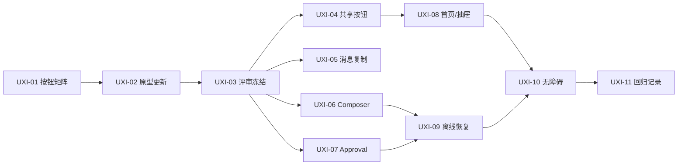

# Mobile 交互体验升级计划

版本：0.1  
状态：验收批次进行中；UXI-01 至 UXI-09 已完成，UXI-10/UXI-11 自动化门已完成，真机验证待执行
更新时间：2026-08-29  
适用范围：`apps/mobile` React Native Viewer/Controller

## 1. 文档目的

本文件把 Mobile 当前“功能可用”推进到“高频操作顺手、反馈明确、状态可理解”的交互升级任务中。它承接已经完成的 MP-01 至 MP-05 和 T4-10，不重新设计认证、同步协议或页面信息架构。

本轮先完成交互设计和原型评审，再进入 React Native 实现。原型结论必须先冻结，代码不得先行引入未评审的新流程。

相关文档：

- [Mobile 任务计划](task-plan.md)
- [Mobile 需求](requirements.md)
- [Mobile 开发说明](development.md)
- [Mobile 页面基线原型](mobile-prototype.html)
- [Mobile 同步文档索引](README.md)

## 2. 当前问题

| 区域 | 当前问题 | 目标 |
| --- | --- | --- |
| 全局按钮 | 主按钮、次按钮、危险按钮和图标按钮差异不够明显；按下、禁用、成功反馈不统一 | 建立稳定的按钮层级、状态和触控反馈 |
| Conversation | 回复操作隐藏在内容语义中，消息复制入口不够显眼 | 每条可复制回复都有就近操作，复制结果即时可确认 |
| Composer | 输入、发送、停止和命令状态之间的优先级容易混淆 | 让“当前能做什么”和“为什么不能做”始终清楚 |
| Approval | 决策动作和安全说明层级不足，提交后等待状态不够连续 | 让用户在确认范围、提交决定、等待真实事件三个阶段不迷失 |
| Session 首页 | 连接状态、待处理 Session、最近 Session 的行动优先级仍可加强 | 首屏先处理高价值事项，再浏览最近工作 |
| 离线/恢复 | 离线可查看与不可执行操作的边界需要更一致 | 明确保留能力、阻断原因和恢复动作 |
| 可访问性 | 静态触控尺寸已有质量门，仍需验证焦点顺序、动态反馈和按钮语义 | TalkBack/VoiceOver 可完整完成主流程 |

## 3. 设计目标与非目标

### 3.1 目标

1. 高频操作在一眼可见的位置完成：打开 Session、发送、停止、复制、审批和返回。
2. 一个操作只保留一个主视觉入口，避免同一层级出现多个竞争按钮。
3. 所有异步动作都有四类反馈：可操作、进行中、已完成、无法继续。
4. 危险操作通过颜色、文案和确认步骤共同表达，不依赖颜色单独传达含义。
5. 组件在 320dp、390dp、768dp 和键盘/安全区场景下保持稳定布局。
6. 原型中的交互命名与 RN 组件、i18n key、测试 ID 保持可映射。

### 3.2 非目标

- 不新增账号、设备、Runtime、Token 或 pairing 管理能力。
- 不改变 PC Runtime 唯一执行源、命令串行、approval first-wins 和真实事件确认语义。
- 不在 Mobile V1 引入推送、附件、复杂编辑、控制权租约或多 PC 管理。
- 不复制 Desktop 三栏布局，也不通过 WebView 包装桌面页面。

## 4. 已确定的交互方向

### 4.1 按钮体系

| 类型 | 用途 | 视觉/行为 | 典型位置 |
| --- | --- | --- | --- |
| Primary | 当前页面唯一主动作 | 品牌实底、轻微阴影、按下缩放、禁用降对比 | Composer 发送、审批允许一次 |
| Secondary | 次要但仍重要的动作 | 白底描边、悬停/按下改变底色 | 重试、刷新、返回首页 |
| Ghost/Icon | 导航或低干扰动作 | 无底色，命中区域不小于 44dp | 返回、设置、打开抽屉、关闭 |
| Destructive | 会撤销、停止或退出的动作 | 危险色描边或浅色底，必要时二次确认 | 停止、拒绝、退出登录 |
| Inline action | 内容附近的轻量操作 | 不抢主层级，带图标与即时状态 | 消息复制、代码复制 |

按钮约束：

- 同一操作组最多一个 Primary。
- 图标按钮必须有语义化 `accessibilityLabel`；图标只作为视觉强化，不单独承担含义。
- 发送按钮在输入为空时禁用；提交后进入进行中态，不允许重复触发。
- 所有按钮保留至少 44dp 的有效触控区域；视觉图标可以小于 44dp。
- 按下、禁用、成功和失败反馈不能造成布局跳动。

### 4.2 消息复制

- 每条非流式 Harness 回复在消息底部显示 `复制` inline action。
- 复制成功后短暂显示 `已复制` 和成功色，并提供轻量 Toast；1.2 至 1.8 秒后恢复默认文案。
- 流式回复不显示复制动作，直到回复进入稳定状态。
- 复制失败显示 `复制失败`，保留原消息和再次尝试入口。
- 代码块继续拥有独立的 `复制代码` 入口，不与整条回复复制混用。

### 4.3 Composer

Composer 保持常驻，但把状态拆成“状态说明”和“当前动作”两层：

1. 状态说明：由 PC Harness 执行、正在补发历史、PC 离线、命令执行中等。
2. 当前动作：发送、停止、重试、关闭状态。

状态规则：

- 输入可编辑但不能发送时，必须解释阻断原因。
- 命令 queued/executing 时，停止动作保留为主操作；发送动作隐藏或禁用。
- unknown/stale 不自动重放，提供解释和显式重试。
- 键盘弹出时 Composer 上移，安全区内仍保留发送和停止的完整触控区域。

### 4.4 Approval 底部面板

Approval 面板采用“摘要 → 风险说明 → 决策”的单向阅读顺序：

- 顶部显示请求状态和工具名。
- 中部固定显示“移动端只展示安全摘要，完整范围请在 PC 核对”。
- 底部只保留 `拒绝` 和 `允许一次` 两个决定。
- 提交后按钮立即锁定，状态依次显示提交中、排队/执行中、等待真实事件或已由其他设备处理。
- 点击遮罩或系统返回只关闭面板，不撤销已经提交的决定。

### 4.5 Session 首页与导航

- 首屏顺序固定为品牌/连接摘要 → 需要处理 → 最近 Session。
- `需要处理` 使用更强的视觉层级，但不增加复杂筛选器。
- 底部导航只保留 Sessions 和设置；Conversation 内通过返回、抽屉和设置按钮完成局部导航。
- Session 抽屉优先展示待处理项，再展示最近项；关闭优先级高于页面返回。

### 4.6 离线与恢复

- 离线状态保留已确认历史和复制操作。
- 发送、停止、审批等控制动作统一禁用，并显示 PC Runtime 离线原因。
- 恢复连接后不自动重放命令；只恢复同步和可操作状态。
- Toast 只用于短反馈，不能替代页面上的持久状态说明。

## 5. 任务拆分

状态：`待执行`、`进行中`、`已完成`、`阻塞`。

| ID | 优先级 | 任务 | 依赖 | 产物 | 验收 |
| --- | --- | --- | --- | --- | --- |
| UXI-01 | P0 | 建立按钮行为矩阵 | 无 | 按钮类型、状态、文案、触控目标、i18n key 对照表 | 覆盖主按钮、次按钮、图标、危险、inline 五类；已完成（2026-08-29） |
| UXI-02 | P0 | 更新 Mobile 交互原型 | UXI-01 | `mobile-prototype.html` 的按钮、复制、Composer、审批和离线状态 | 可走通首页、Conversation、复制、审批、设置、返回和恢复连接；已完成初版（2026-08-29） |
| UXI-03 | P0 | 评审并冻结高频操作路径 | UXI-02 | 评审记录和决策清单 | 用户确认主操作位置、按钮层级和错误反馈 |
| UXI-04 | P0 | 实现共享 Button/IconButton 状态 | UXI-03 | `AppButton`、`IconButton` 的统一状态和视觉回归 | 44dp、禁用/按下稳定、无布局跳动、无默认 RN Button；已完成（2026-08-29） |
| UXI-05 | P0 | 实现消息复制反馈 | UXI-03、T4-06 | `EventTimeline`/`MarkdownText` 复制入口和成功/失败状态 | 非流式回复可复制；代码块独立复制；失败可重试；已完成（2026-08-29） |
| UXI-06 | P0 | 收口 Composer 操作优先级 | UXI-03、T4-07 | 发送、停止、重试、unknown/stale/offline 状态映射 | 任何状态只有正确的主动作，命令不会重复提交；已完成（2026-08-29） |
| UXI-07 | P0 | 收口 Approval 面板反馈 | UXI-03、T4-08 | ApprovalPanel 的提交锁、等待态、already-decided 和返回行为 | first-wins、真实事件确认和遮罩/返回语义不回退；已完成（2026-08-29） |
| UXI-08 | P1 | 优化 Session 首页和抽屉行动层级 | UXI-03、T4-05 | Session 首页、连接摘要、抽屉和底部导航调整 | 待处理优先；整行导航；返回优先级稳定；已完成（2026-08-29） |
| UXI-09 | P1 | 完成离线/恢复交互闭环 | UXI-06、UXI-07 | 连接状态、禁用原因、恢复后状态和 Toast 规范 | 不自动重放；历史可读；控制动作边界明确；已完成（2026-08-29） |
| UXI-10 | P0 | 完成 TalkBack/VoiceOver 高频流程验收 | UXI-04 至 UXI-09 | 真机焦点遍历记录和问题清单 | 登录、打开 Session、复制、审批、停止、返回、设置均可完成；自动化门已完成，真机待执行 |
| UXI-11 | P1 | 建立移动端交互回归记录 | UXI-04 至 UXI-10 | `execution-log.md` 新轮次和截图/录屏证据 | 320/390/768、键盘、安全区、横竖屏和网络切换有记录；矩阵已落盘，真机证据待补 |

## 6. 实施顺序



推荐按三个批次执行：

1. 设计批次：UXI-01 至 UXI-03。只改任务文档和原型，先完成评审。
2. 组件批次：UXI-04 至 UXI-07。集中改共享按钮、消息操作、Composer 和 Approval，避免页面局部风格漂移。
3. 验收批次：UXI-08 至 UXI-11。完成首页细节、离线恢复、屏幕阅读器和多尺寸真机回归。

## 6.1 UXI-01 按钮行为矩阵

| 类型 | 默认 | 按下 | 进行中 | 完成 | 失败/阻断 |
| --- | --- | --- | --- | --- | --- |
| Primary | 品牌实底 + 白色文字 | 轻微缩放 + 加深底色 | 保留尺寸，显示进度或锁定 | 成功色反馈或状态 Toast | 禁用并保留阻断原因 |
| Secondary | 白底 + 强边框 | 浅色底 | 锁定并降低对比 | 返回默认态 | 危险提示使用 Banner，不伪装成功 |
| Ghost/Icon | 透明底 + 44dp 命中区 | 浅色底 + 轻微缩放 | 图标替换为进度指示 | 保持原位置 | 禁用降低对比，不改变布局 |
| Destructive | 危险色描边/浅底 | 加深危险色底 | 锁定，明确动作对象 | 以结果状态替代按钮 | 必要时二次确认，不能只靠颜色 |
| Inline action | 图标 + 短文案 | 浅色底 | 锁定或显示进度 | `已复制`/`已完成`短暂反馈 | `复制失败`保留再次尝试 |

映射到当前 RN：

| 交互 | 类型 | 默认文案 | 成功/进行中文案 | 入口 |
| --- | --- | --- | --- | --- |
| 发送消息 | Primary | 发送消息 | 提交中 / 已发送 | `ConversationComposer` |
| 停止任务 | Destructive | 停止当前任务 | 正在停止 | `ConversationComposer` |
| 重试同步/命令 | Secondary | 重试/刷新 | 正在重试 | `AppButton` 状态动作 |
| 允许一次 | Primary | 允许一次 | 正在提交 / 等待真实事件 | `ApprovalPanel` |
| 拒绝 | Destructive | 拒绝 | 正在提交 / 已拒绝 | `ApprovalPanel` |
| 复制回复 | Inline action | 复制 | 已复制 / 复制失败 | `EventTimeline` / `MarkdownText` |
| 返回、设置、抽屉、关闭 | Ghost/Icon | 由 `accessibilityLabel` 提供语义 | 不改变布局 | `IconButton` |

## 7. 质量门

### 静态与单元测试

```bash
pnpm --filter @harndock/mobile typecheck
pnpm --filter @harndock/mobile test
pnpm check:docs
```

必须覆盖：

- Button/IconButton 的状态映射和 44dp 触控目标。
- 复制成功、复制失败、流式回复隐藏复制入口和代码块独立复制。
- Composer 的空输入、发送中、执行中、停止中、unknown、stale、offline。
- Approval 的提交锁、already-decided、遮罩关闭和系统返回。
- i18n 中英文按钮文案和动态状态文案 parity。

### 真机与视觉验收

- 设备宽度：320dp、390dp、768dp。
- 状态：online、offline、reconnecting、approval、unknown、already-decided。
- 环境：软键盘、安全区、系统返回、横竖屏、网络切换、长回复。
- 证据：至少包含主流程截图、按钮状态截图、屏幕阅读器焦点遍历记录和异常路径记录。

## 8. 完成定义

本专项只有在以下条件全部满足后才可标记完成：

1. UXI-01 至 UXI-03 有已确认的原型和决策记录。
2. Button、复制、Composer、Approval、Session 首页和离线恢复的实现与原型一致，或有明确偏差记录。
3. 所有主流程按钮有稳定的可操作、进行中、完成、失败/阻断反馈。
4. 复制入口不泄漏工具参数、结果、命令 payload 或未知事件 payload。
5. 单元测试、类型检查、文档检查和真机视觉验收全部通过。
6. TalkBack/VoiceOver 能完成登录、进入 Conversation、复制消息、处理审批、停止任务、返回和打开设置。
7. `task-plan.md`、`execution-log.md` 和本文件中的状态、证据和剩余风险一致。

## 9. 当前决策与待决事项

### 已决策

- 复制按钮属于消息底部 inline action，而不是全局浮动按钮。
- 发送按钮是 Composer 唯一 Primary；停止使用危险样式。
- Approval 使用底部面板，不改为全屏跳转。
- 离线不清空历史，不自动重放控制命令。
- 所有按钮视觉升级不得降低现有可访问性和最小触控目标。

### 待评审

| 事项 | 评审时点 | 默认建议 |
| --- | --- | --- |
| 复制按钮默认显示文字还是仅图标 | UXI-03 | 默认显示图标 + “复制”，窄屏再评估仅图标 |
| Toast 是否需要系统级震动 | UXI-03 | V1 不增加震动，避免重复反馈 |
| Composer 是否增加附件/快捷提示 | UXI-03 | 不进入本专项，保持输入聚焦 |
| 深色主题按钮对比度 | UXI-10 | 先完成结构和焦点验收，再单独冻结深色 token |
