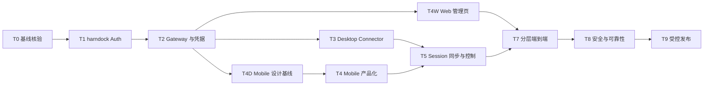

# 移动端多端同步与远程控制任务计划

版本：2.0
状态：Gateway Web、Desktop、Mobile 原型、MP-01 认证、MP-02 Session 首页、MP-03 Conversation、常驻 Composer、MP-04 审批接管和 MP-05 设置与诊断代码纵切已完成；T4-10 Android Emulator 视觉证据与 T7-03 Auth 生命周期已完成；T7-07 真实 approval 竞争仍待关闭
更新时间：2026-08-28

## 1. 文档目的

本文件把 `implementation-plan.md` 的里程碑拆成可执行任务，作为 harndock Auth、Gateway、PC Connector、React Native Viewer、独立 Web Gateway 管理页、BlueStacks 端到端测试和受控发布的统一任务清单。

任务计划覆盖两个仓库：

- 公开仓库：`<harndock-repo>`
- 私有服务端与独立 Web Gateway 管理页：`<dsh-sync-server-repo>`（管理页位于 `apps/gateway-console`）

本文件不替代 `requirements.md`、`development.md` 和 `implementation-plan.md`：

- `requirements.md` 定义用户需求、页面和验收标准。
- `development.md` 定义架构、协议、API、数据模型和安全边界。
- `implementation-plan.md` 定义里程碑和发布阶段。
- 本文件定义执行顺序、任务产物、验证命令和完成判定。

## 2. 当前基线与风险

| 基线项 | 文档声明 | 执行前核验要求 |
| --- | --- | --- |
| 公共协议与 Connector | 功能完成 | 运行协议测试、Connector 单测和真实 Harness smoke |
| Gateway/Admin/Worker/Docker | 功能完成 | Gateway `7019`、Admin `7018`、迁移、健康检查和重启验证 |
| harndock Auth | 功能完成 | `/v1/auth/*`、`/v1/me`、refresh 轮换和 logout 已有源码与契约测试；发布前仍需真实环境回归 |
| 设备/Runtime/token | 功能完成 | 核验列表、签发、撤销、过期和设备级级联失效 |
| React Native Viewer 底层链路 | 部分完成 | Session projection、命令、origin 校验和 access token SecureStore 已实现，可作为新 UI 的数据基础 |
| React Native Viewer 产品 UI | 部分完成 | MP-01 至 MP-05 已实现；Android Emulator 已完成登录/设置/会话恢复、320/390/768 视觉、access 过期 refresh 轮换、logout 和设备撤销重登录。T7-06 已关闭；T7-07 approval 仍待关闭 |
| Web Gateway 管理页 | 已完成 | `apps/gateway-console` 的 Auth、账号、设备、Runtime、Token、pairing、诊断、15 项自动化和真实 Gateway + Desktop E2E 均已通过；Admin `7018` 与 Gateway `7019` 边界固定 |
| Desktop Remote Sync | 已完成 | 配对、Keychain、WebSocket、解除配对、首启引导、三条配置入口、Gateway 连接、远端 Runtime online、最近心跳和生产 Runtime/profile 升级均已通过真实 Release Desktop 验收 |
| HTML 原型与文档 | Mobile 基线已完成 | 综合 `prototype.html` 与 `mobile-prototype.html` 已分离；MP-01–MP-05、Harness 映射和 online/approval/offline 已于 2026-08-24 评审通过 |
| 生产发布 | 未完成 | M6/M7 质量门完成后才允许灰度 |

执行原则：代码、运行实例和测试结果优先于文档中的“已完成”文字。发现声明与实际代码不一致时，先建立阻塞任务，不能直接把端到端任务标记通过。

## 3. 状态、优先级与完成定义

状态取值：

- `待执行`：已拆解但尚未开始。
- `进行中`：当前批次正在实施或验证。
- `已完成`：实现、测试和产物均已满足任务完成条件。
- `阻塞`：缺少外部环境、接口或决策，且当前无法继续。
- `不适用`：经评审确认不属于当前发布范围。

优先级取值：

- `P0`：阻断核心连接、认证、同步、控制或数据安全。
- `P1`：阻断完整产品体验或发布质量，但不影响基础链路。
- `P2`：优化、文档补充或后续版本能力。

每个任务完成必须同时满足：

1. 代码或文档变更落在正确仓库和模块边界内。
2. 有明确的验证命令、测试记录或可复现操作步骤。
3. 不引入客户端自报 `accountId`/`deviceId`、明文 token、PC 私钥或公网 HTTP 凭据。
4. 相关需求编号、开发文档章节或原型页面可以回溯。
5. 任务结果已更新本文件状态和证据链接。

## 4. 执行顺序总览



T0 是前置闸门。若 T0 发现当前代码与完成声明不一致，T1/T2 必须先修复服务端契约，再继续移动端端到端测试。

T4D 是 Mobile 页面代码的评审闸门，现已通过。后续主线固定为 T4 Mobile 产品化 → T5 Mobile 同步/控制验证 → T7 Mobile E2E；T8/T9 在 Mobile P0 验收关闭前不得提前占用产品开发批次。

## 5. 任务清单

### T0：基线核验与测试环境

| ID | 优先级 | 任务 | 依赖 | 产物/验收 | 状态 |
| --- | --- | --- | --- | --- | --- |
| T0-01 | P0 | 盘点两仓库分支、工作区变更、运行入口和版本 | 无 | 输出当前分支、commit、脏文件和风险清单 | 已完成 |
| T0-02 | P0 | 核验 harndock Auth 实际路由、迁移、配置和 Docker 服务 | T0-01 | 初次核验发现的 Auth 缺口已由 T1 补齐；Gateway/Docker 基础服务和契约测试通过，详见执行记录 | 已完成 |
| T0-03 | P0 | 固定本地环境矩阵 | T0-01 | 已记录 Node/pnpm、Docker、PostgreSQL、Redis、BlueStacks、Android adb 版本 | 已完成 |
| T0-04 | P0 | 建立端到端测试账号和测试数据 | T0-02 | 测试账号、Mobile/PC Device、Runtime 和 pairing 数据按证据批次创建，凭据不入库且结束后精确清理 | 已完成 |
| T0-05 | P1 | 固定测试日志和证据目录 | T0-01 | 已建立证据目录、记录模板和脱敏规则 | 已完成 |

建议命令：

```bash
git status --short
git branch --show-current
pnpm check:docs
docker compose -f deploy/compose.yaml config
adb devices
```

### T1：harndock Auth 与账号生命周期

| ID | 优先级 | 任务 | 依赖 | 产物/验收 | 状态 |
| --- | --- | --- | --- | --- | --- |
| T1-01 | P0 | 核验账号表、Auth subject、密码摘要、会话和 refresh session 迁移，按缺口补齐 | T0-02 | `006_dsh_auth.sql` 已应用；scrypt 和 token digest 已通过数据库测试 | 已完成 |
| T1-02 | P0 | 建立唯一管理员初始化并移除注册 | T1-01 | 环境变量只在首次启动创建管理员；原生/Web 注册 API 均为 404 | 已完成 |
| T1-03 | P0 | 核验登录接口，按缺口补齐 | T1-01 | 返回短期 access/refresh；错误不区分账号不存在和密码错误 | 已完成 |
| T1-04 | P0 | 核验 refresh token 轮换，按缺口补齐 | T1-01、T1-03 | 旧 refresh/access 失效，refresh 重放失败，新 token 可调用 `/v1/me` | 已完成 |
| T1-05 | P0 | 核验 logout、会话撤销和账号恢复边界，按缺口补齐 | T1-03、T1-04 | logout 撤销会话；无可信恢复因子时不开放匿名 reset API | 已完成 |
| T1-06 | P0 | 核验 `/v1/me` 和 principal 映射，按缺口补齐 | T1-03 | 从 Bearer principal 推导 Account/Device/scope，不接受客户端自报账号 | 已完成 |
| T1-07 | P0 | 实现管理员 curl 凭据修改 | T1-01、T1-03 | 当前凭据使用 Basic Auth；成功修改后旧 refresh/access 会话失效 | 已完成 |
| T1-08 | P0 | 核验并补齐 Auth 单测和 API 契约测试 | T1-02 至 T1-07 | 覆盖初始化幂等、无注册、登录、凭据修改、轮换、重放、logout、限流和真实 PostgreSQL | 已完成 |

### T2：Gateway、设备、Runtime 与 token

| ID | 优先级 | 任务 | 依赖 | 产物/验收 | 状态 |
| --- | --- | --- | --- | --- | --- |
| T2-01 | P0 | 核验统一 Auth middleware，按缺口补齐 | T1-06 | REST/Viewer stream 从 Bearer principal 得到账号和设备；PC WS 从 challenge 签名得到 Runtime identity；均不接受客户端自报身份 | 已完成 |
| T2-02 | P0 | 核验 Mobile Device 注册和设备状态，按缺口补齐 | T1-06 | 首次登录注册安装实例；设备撤销立即关闭连接 | 已完成 |
| T2-03 | P0 | 核验 Runtime 列表、心跳和在线状态，按缺口补齐 | T2-02 | 账号只能看到自己的 Runtime；离线状态可解释 | 已完成 |
| T2-04 | P0 | 核验 token 签发、列表、过期和撤销，按缺口补齐 | T1-06、T2-02 | 原始 token 只返回一次；服务端只存 digest 和元数据 | 已完成 |
| T2-05 | P0 | 核验设备撤销级联失效，按缺口补齐 | T2-02、T2-04 | 设备 token、REST、stream、WS、命令全部失效 | 已完成 |
| T2-06 | P0 | 核验 Gateway origin 和 HTTP loopback 配置，按缺口补齐 | T0-03 | 生产 HTTPS；开发 HTTP 仅允许 loopback；公网 HTTP 被拒绝 | 已完成（客户端协议校验 + Compose loopback 默认） |
| T2-07 | P1 | 核验 Docker Compose、迁移、health live/ready 和重启行为 | T1、T2-01 至 T2-06 | 干净环境启动、迁移幂等、依赖故障有明确状态 | 已完成 |
| T2-08 | P0 | 核验并补齐 Gateway 集成测试 | T2-01 至 T2-07 | PostgreSQL/Redis/WS/权限/撤销链路通过 | 已完成 |
| T2-09 | P0 | 落实零基 Session 游标和 Worker 命令回收 | T2-08 | `afterSeq=-1` 可读取；queued 过期为 `expired`；已下发未确认为 `unknown`；均有审计和配置化维护间隔 | 已完成 |
| T2-10 | P0 | 新增当前账号自助 pairing code 管理 API | T1-06、T2-02、T3-02 | 登录用户只能创建、查看状态和撤销自己的 pairing code；原文只返回一次；列表仅含元数据；CLI 保留为部署恢复工具 | 已完成（迁移 009、create/list/revoke、审计、账号隔离和 PostgreSQL 测试通过） |

### T3：Desktop Harness Connector

| ID | 优先级 | 任务 | 依赖 | 产物/验收 | 状态 |
| --- | --- | --- | --- | --- | --- |
| T3-01 | P0 | 校验 Desktop Remote Sync 配置模型 | T2-06 | 只保存 origin、Device/Runtime 元数据和 outbox 路径，不保存 token/私钥 | 已完成 |
| T3-02 | P0 | 完成 pairing exchange 和 Ed25519 challenge/register | T2-02、T2-06 | 配对码一次性消费；公钥绑定设备；重放失败 | 已完成 |
| T3-03 | P0 | 接入系统 Keychain | T3-02 | 私钥只进入 Keychain；删除/解除配对行为明确 | 已完成 |
| T3-04 | P0 | 完成 `/v1/ws` 连接、心跳、重连和 backoff | T3-02、T3-03 | Gateway/Runtime 重启和断网可恢复 | 已完成 |
| T3-05 | P0 | 完成 snapshot/event/ack/outbox/游标缺口处理 | T3-04 | 重复事件不重复投影；缺口可通过 `readFrom()` 校正 | 已完成 |
| T3-06 | P0 | 接入真实 Harness Session 和 control adapter | T3-05 | prompt/cancel/approval 只通过 PC Runtime 执行 | 已完成 |
| T3-07 | P1 | 完成 Desktop 配置页 smoke | T3-01 至 T3-06 | origin、配对、状态、重新配对和解除配对可操作 | 已完成 |
| T3-08 | P1 | 对齐 Desktop 与 Gateway 的远端连接状态 | T2-03、T3-04、T4W-03 | Desktop 可区分本地 Runtime ready、Gateway 已连接、远端 Runtime online 和最近心跳；解除配对后状态一致 | 已完成（nonce Unix 控制帧、持续心跳、Release UI、PostgreSQL online 交叉验收和解除配对状态归零单测通过） |
| T3-09 | P0 | 建立 Desktop Gateway 配置的可发现入口 | T3-07 | 未配对首次启动停留在配置引导并可明确跳过；Harness Settings/侧栏有常驻入口；应用菜单、`File → Gateway & Remote Sync...` 与 `Cmd/Ctrl+,` 兜底；不开放通用远程 Tauri IPC | 已完成（首启门、明确跳过、Harness 常驻入口、同源固定动作 + nonce Unix 控制帧，以及应用菜单/File/快捷键三条原生入口均已通过真实 Desktop 验收） |

### T4D：Mobile 产品、视觉与交互基线

| ID | 优先级 | 任务 | 依赖 | 产物/验收 | 状态 |
| --- | --- | --- | --- | --- | --- |
| T4D-01 | P0 | 按代码事实审计当前 Mobile UI 与 Harness 心智差异 | T0-01 | 记录手工 token、设备库存优先、单体 `App.tsx`、默认控件、重复调试事件等差异，不把底层链路完成等同 UI 完成 | 已完成 |
| T4D-02 | P0 | 冻结 Mobile V1 信息架构与 Harness 映射 | T4D-01 | `requirements.md` §4.0 固定 AuthGate、Session 首页、Conversation、审批接管、设置/诊断；明确不复制桌面三栏/WebView | 已完成 |
| T4D-03 | P0 | 建立独立 Mobile HTML 交互原型 | T4D-02 | `mobile-prototype.html` 可进入 MP-01–MP-05，并可切换 online/approval/offline、Session 抽屉、登录/退出和消息发送 | 已完成 |
| T4D-04 | P1 | 固定 Mobile design token 与组件清单 | T4D-02、T4D-03 | neutral-bluish/DeepSeek blue/状态色、字体、间距、圆角、44×44 触控目标，以及 Header/Button/Banner/Card/Sheet/Composer/Approval 组件清单进入开发文档 | 已完成（首版；深色主题是否首发待评审） |
| T4D-05 | P0 | 完成 Mobile 产品与视觉评审门 | T4D-02 至 T4D-04 | 用户确认 MP-01–MP-05 的信息层级、导航、Conversation、Composer、审批和设置边界；评审意见落入文档/原型 | 已完成（2026-08-24 用户确认原型无问题） |

### T4：React Native Mobile 产品化

| ID | 优先级 | 任务 | 依赖 | 产物/验收 | 状态 |
| --- | --- | --- | --- | --- | --- |
| T4-00 | P0 | 拆分 Mobile UI 架构并建立主题/基础组件壳 | T4D-05 | 从单体 `App.tsx` 拆分 navigation/screens/features/components/theme/services；先交付 Harness 同源 token、AppHeader、Button/IconButton、Banner、Card、StatusDot、EmptyState 和导航占位；为 Sheet/Composer/ApprovalPanel 固定接口但由对应纵切实现；现有 sync 测试/typecheck 不回退 | 已完成（2026-08-24；screen/feature/service 分层、基础组件、35 项测试） |
| T4-01 | P0 | 实现 AuthGate 状态机 | T4-00、T4-03、T4-04、T1-03、T1-04 | 受控 Splash、未登录、登录中、已登录、refresh、失效、撤销和退出状态不串台，不闪现受保护页面 | 已完成（2026-08-24；启动 `/v1/me` 校验、access 过期/401 单飞 refresh、旋转保存、logout、REST/WS 撤销回退、公开/受保护导航隔离，56 项测试） |
| T4-02 | P0 | 实现 MP-01 harndock Auth 登录/退出与连接页 | T4-01、T1-02 至 T1-05 | Gateway origin + 管理员登录；不提供注册/生产手工 token；不持久化密码；错误与返回状态稳定 | 已完成（2026-08-24；原生 login 契约、稳定 installation ID、正式 SecureStore 会话、登录/退出 UI、错误映射、生产 debug token 双门禁，64 项测试） |
| T4-03 | P0 | 完成 Gateway origin 持久恢复与协议校验 | T4-00、T2-06 | 支持 HTTPS 和开发 loopback HTTP；拒绝 path/query/hash；修改 origin 后重新验证和建立会话 | 已完成（2026-08-24；SecureStore `gateway.origin.v1`、启动恢复、严格 origin/loopback 校验、变更清除旧 token，39 项测试） |
| T4-04 | P0 | 完成 SecureStore 会话生命周期 | T4-00、T4-03 | access/refresh 分项安全保存、轮换和原子清理；密码/Session payload 不进入 SecureStore/SQLite/日志/截图 | 已完成（2026-08-24；schema v1、双槽 active pointer、坏代/失败恢复、完整清理与旧开发 token 兼容，46 项测试） |
| T4-05 | P0 | 实现 MP-02 Session 首页和 Session 抽屉 | T4-01、T4-02、T2-01、T3-05 | 需要处理/最近活动、PC 紧凑状态、分页/加载/空/离线；完整设备库存移出首页；整行进入 Conversation | 已完成（2026-08-25；复用不透明游标自动分页，分组/紧凑 PC 状态/加载空离线错误态、整行导航、Conversation 抽屉和系统返回优先级已实现，70 项测试及 production Android bundle 通过） |
| T4-06 | P0 | 实现 MP-03 Harness 同源事件时间线 | T4-05、T2-01、T3-05 | 消息、流式 assistant、工具/命令安全摘要、未知事件、补发和回到底部；移除重复调试事件列表 | 已完成（2026-08-25；消息/非消息事件按 seq 合并，chunk 去重、工具折叠安全摘要、命令状态、未知事件占位、历史补发和回到底部已实现，75 项测试及 production Android bundle 通过） |
| T4-07 | P0 | 实现常驻 Composer 与 prompt/cancel/命令状态 | T4-06、T2-01、T3-06 | 键盘安全区上方固定；发送、排队、执行、停止中、stale、unknown、offline 和重试状态准确 | 已完成（2026-08-25；常驻键盘安全 Composer、prompt/cancel、queued/executing/stopping/stale/unknown/offline、明确重试/刷新和幂等 commandId 语义已实现，83 项测试及 production Android bundle 通过） |
| T4-08 | P0 | 实现 MP-04 审批接管 | T4-06、T4-07、T3-06、T5-04 | 等待审批时接管 Composer；允许一次/拒绝、提交锁、already decided 和真实事件确认完整 | 已完成（2026-08-25；ApprovalPanel 完全接管 Composer、只显示安全工具摘要，同步 approvalId 提交锁、queued/executing/completed 等待真实事件、stale/unknown/offline 和 already-decided 已实现，94 项测试及 production Android bundle 通过） |
| T4-09 | P1 | 实现 MP-05 Mobile 设置与诊断摘要 | T4-02 至 T4-05、T1-06 | 当前账号/Device/scope、Gateway、PC Runtime、stream、游标/补发、退出；设备/Token/pairing 完整管理仍由 T4W 承接 | 已完成（2026-08-25；设置页已从 Session 首页和 Conversation 进入，共享单一 ViewerSync/目录 Provider，真实 inventory 与 AuthGate 会话状态生成脱敏摘要；新增 MP-05 模型/架构安全测试，99 项 Mobile 测试及 Android bundle 通过） |
| T4-10 | P1 | 完成 320/390/768、键盘、安全区和可访问性验收 | T4-05 至 T4-09 | 无横向溢出；焦点/读屏/系统返回可用；drawer/sheet 优先关闭；触控目标≥44；深色 token 不破坏结构 | 部分完成（2026-08-26 至 2026-08-28；Android Emulator 已通过 320/390/768、键盘、安全区、系统返回、accessibility tree 和 release 网络回归；仍缺 TalkBack/VoiceOver 实际焦点遍历） |

### T4W：独立 Web Gateway 管理页

| ID | 优先级 | 任务 | 依赖 | 产物/验收 | 状态 |
| --- | --- | --- | --- | --- | --- |
| T4W-00 | P0 | 建立 Gateway Admin Web 正式生产入口 | T4W-01、T2-07 | 独立 Admin `7018` 直接进入 Console 并同源代理 HTTP API；Gateway API/WS 使用 `7019`；正式镜像包含静态产物；SPA 刷新可用且 WS 不经过 Admin | 已完成（独立 Admin 进程、代理/cookie 契约、正式镜像和 7018/7019 运行隔离验收通过；8081 无监听） |
| T4W-01 | P0 | 建立 Web 管理页路由壳和未登录保护 | T1-02 至 T1-05 | 登录、refresh、logout 和会话失效状态可进入；无注册入口 | 已完成（独立 `apps/gateway-console`、路由/保护/会话恢复已实现，`/register` 为 404） |
| T4W-02 | P0 | 接入唯一管理员初始化、登录、refresh、logout 和凭据修改 | T4W-01 | 环境变量仅首次初始化；curl 修改后旧会话失效；错误文案稳定 | 已完成（PostgreSQL 初始化/修改/会话撤销集成测试、7018 登录/logout 和 7019 鉴权 smoke 通过） |
| T4W-03 | P0 | 实现账号、Gateway origin、Desktop 配对和 Runtime 摘要 | T2-02、T2-03、T2-06 | 当前账号、设备和 Runtime 状态来自真实 API | 已完成（真实管理员账号、7018 Admin / 7019 Desktop origin、配对消费和 Runtime online/heartbeat 已通过浏览器、Release Desktop 与 PostgreSQL 联合验收） |
| T4W-04 | P0 | 实现设备列表、撤销确认和重新配对提示 | T2-02、T2-05、T4W-03 | 当前/其他设备、在线状态、撤销级联和当前设备退出可验证 | 已完成（隔离 `localhost:7018` 浏览器设备真实撤销后立即退出且刷新无法恢复；其 Token 失效、审计落库，Desktop 与其他管理设备保持有效） |
| T4W-05 | P0 | 实现 Token 列表、创建、一次性展示、复制关闭和撤销 | T2-04、T4W-03 | 设备/scope/TTL 可选；列表不显示原始 token；撤销状态准确 | 已完成（真实管理页签发 15 分钟 `session.read` 临时 Token，原文关闭后不可恢复，列表元数据和撤销状态均已验收） |
| T4W-06 | P1 | 实现连接诊断、账号隐私和响应式可访问性 | T4W-03 至 T4W-05 | P-05/P-06 状态完整；无跨账号和运维管理员入口 | 已完成（真实管理页 live/ready、1/1 Runtime、账号隐私、refresh 恢复和 Web logout 已验收；响应式与导航可访问性由自动化覆盖） |
| T4W-07 | P0 | 实现 pairing code 自助创建、一次性展示、状态和撤销 | T2-10、T4W-03 | 仅管理当前账号配对码；原文只在创建结果显示一次；Desktop 可直接消费；过期/已用/已撤销状态准确 | 已完成（独立路由、真实 API、TTL、一次性结果、active/consumed/expired/revoked 状态、撤销确认和响应式表格已通过 typecheck/build/服务端回归） |
| T4W-08 | P0 | 加固 Web Auth 会话 | T4W-01、T1-04、T1-05 | refresh 凭据不落普通 Web Storage；采用 HttpOnly/SameSite 或经安全评审批准的等价边界；刷新、退出和 401 失效不产生半登录状态 | 已完成（独立 Web Auth cookie 路由、HttpOnly/SameSite=Strict、生产 Secure、内存 access token、单次共享 refresh 和安全退出已通过测试） |
| T4W-09 | P0 | 建立 Gateway Console 自动化测试 | T4W-02 至 T4W-08 | 覆盖 API client、Auth 恢复、路由保护、401、当前设备撤销、Token/pairing 一次性结果和错误态；测试可在 CI 重复执行 | 已完成（Vitest 4 + jsdom + Testing Library，15/15 通过并接入根 `pnpm test`） |
| T4W-10 | P0 | 完成真实 Gateway Web 全链路验收 | T4W-00、T2-10、T3-09、T4W-02 至 T4W-09 | 从 Admin `7018` 进入，确认 Gateway `7019` API/WS 隔离；管理员登录/refresh/logout、账号、设备、Runtime、Token、pairing、诊断、当前设备退出、Desktop 打开配置页和消费配对码全部留有脱敏证据 | 已完成（真实 Auth、账号、设备、Runtime、Token、pairing、诊断、Desktop 配对/重连，以及隔离浏览器当前设备撤销和退出均已留证） |

### T5：Session 同步与远程控制

| ID | 优先级 | 任务 | 依赖 | 产物/验收 | 状态 |
| --- | --- | --- | --- | --- | --- |
| T5-01 | P0 | 验证 Session 目录、快照、历史和 stream | T2-01、T3-05、T4-04；产品 UI 验收依赖 T4-05/T4-06 | 两个 Mobile Device 看到一致的 session/seq，MP-02/MP-03 状态准确 | 部分完成（实时 Session、快照、历史底层与 MP-02/MP-03 UI 已接入；最新 BlueStacks 双端验证待完成） |
| T5-02 | P0 | 验证 cursor gap 恢复 | T5-01 | pause → REST replay → resume；无跳号和重复 | 已完成（T7-06 真实离线窗口按 seq 42–92 连续补发，共 51 条唯一事件；Gateway 与 Mobile 冷启动均核验无丢失、无重复） |
| T5-03 | P0 | 验证 prompt/cancel/approval 命令状态 | T3-06、T5-01 | queued/executing/completed/rejected/unknown 显示准确 | 部分完成（既有 prompt/cancel E2E 已验证，最新 Composer/ApprovalPanel 已接入完整命令状态；approval 与最新 BlueStacks 回归待补） |
| T5-04 | P0 | 验证并发命令串行和审批 first-wins | T5-03 | 只有一个 executing；竞争审批只有一个决定生效 | 已完成（命令队列事务/锁、Session 串行领取和审批 pending 条件更新通过 compose PostgreSQL 并发验收） |
| T5-05 | P0 | 验证设备撤销对同步和控制的影响 | T2-05、T5-03 | 撤销后读取、stream、WS 和命令均失败 | 已完成（旧 REST 凭据返回 401；PostgreSQL Token 与未完成命令级联失效；Viewer Stream 与 PC WS 主动关闭已验收） |
| T5-06 | P1 | 把 offline、refresh、Runtime offline 和 unknown 状态迁移到新 UI | T4-06 至 T4-10、T5-01 至 T5-05 | 用户在 MP-02/MP-03/MP-05 可区分离线、补发中、状态未知和无权限 | 部分完成（MP-02/MP-03、Composer 与 ApprovalPanel 已接入 PC 离线、历史补发、stale、unknown 和 already-decided 状态；MP-05 与最新 BlueStacks 视觉验收待执行，历史证据见 `test-evidence/20260822-T5-06-offline-refresh-ui/record.md`） |

### T6：文档、原型与验收资产

| ID | 优先级 | 任务 | 依赖 | 产物/验收 | 状态 |
| --- | --- | --- | --- | --- | --- |
| T6-01 | P1 | 维护需求、开发、实施和任务计划交叉引用 | 文档基线 | FR/P/MP/API/任务 ID 可相互追溯；设计/原型/代码/E2E 状态分开 | 已完成（2026-08-24 Mobile 重排） |
| T6-02 | P1 | 分离综合原型与 Mobile 产品原型 | T4D-02 | `prototype.html` 保留 Web/Desktop；`mobile-prototype.html` 覆盖 MP-01–MP-05 和 online/approval/offline，脚本/DOM/交互检查通过 | 已完成（2026-08-24 视觉评审通过） |
| T6-03 | P1 | 建立端到端测试记录模板 | T0-05 | 已覆盖环境、步骤、结果、requestId、截图路径和清理确认 | 已完成 |
| T6-04 | P1 | 建立失败问题模板和回归清单 | T0-05 | 已在测试记录模板中覆盖缺陷、复现、后续任务和清理确认 | 已完成 |

### T7：Android Emulator / BlueStacks 端到端测试

| ID | 优先级 | 任务 | 依赖 | 产物/验收 | 状态 |
| --- | --- | --- | --- | --- | --- |
| T7-01 | P0 | 配置 Android adb 和测试 APK | T0-03、T4-01 | `adb devices` 可见；APK 安装、启动和日志可采集 | 已完成（BlueStacks transport 不稳定时使用 Android Studio AVD） |
| T7-02 | P0 | 测试 Gateway origin 配置 | T2-06、T4-03 | HTTPS、loopback HTTP、非法 origin、不可达地址均有结果 | 已完成 |
| T7-03 | P0 | 测试管理员登录、refresh、logout | T1、T4-01 至 T4-04 | MP-01 不存在注册/生产手工 token；refresh 可恢复；logout 后受保护接口失败 | 已完成（2026-08-26 Android Emulator；登录/冷启动恢复/logout/重新登录通过，强制当前 access 过期后冷启动完成 refresh 轮换且未返回 MP-01；旧 access/auth session 被撤销，仍仅 1 组有效会话） |
| T7-04 | P0 | 测试 Mobile Device 和 token 生命周期 | T2-02、T2-04、T4-04、T4-09 | 设备注册、MP-05 会话摘要、撤销和重新登录可完成 | 已完成（2026-08-26 Android Emulator；MP-05 账号/Device/scope 摘要、logout、设备撤销级联和新 Device 重登记均通过） |
| T7-05 | P0 | 测试 PC pairing 到 Runtime online | T3、T7-02 | Desktop 配对后 BlueStacks 能看到 PC 在线和 Runtime 心跳 | 已完成 |
| T7-06 | P0 | 测试 Session 查看、断网恢复和游标补发 | T5、T7-05 | 事件顺序一致；断网后恢复无重复和丢失 | 已完成（2026-08-26 Android Emulator + 真实 Desktop Harness；Mobile force-stop 期间由 PC 产生 `T7_OFFLINE_REPLAY_OK`，恢复后 Gateway 收到连续 seq 42–92 共 51 条事件，事件主键无重复，Mobile 冷启动显示完整回复） |
| T7-07 | P0 | 测试 prompt/cancel/approval | T5、T7-06 | 真正由 PC Harness 执行；状态和事件一致 | 部分完成（prompt/cancel 通过；2026-08-28 核查确认当前 Desktop Harness 未产生 `approval/requested`，待恢复可触发升级审批的工具配置后补允许一次、拒绝、first-wins/already-decided） |
| T7-08 | P0 | 测试设备撤销和重新配对 | T2-05、T7-04 | 旧设备失效；重新登录/配对后恢复 | 已完成（2026-08-26 Android Emulator；旧 Device/token 失效并回 MP-01，修复 revoked installation 重登记后生成全新 active Device，旧 Device 保持 revoked） |

### T8：可靠性、安全与容量

| ID | 优先级 | 任务 | 依赖 | 产物/验收 | 状态 |
| --- | --- | --- | --- | --- | --- |
| T8-01 | P0 | 执行认证、IDOR、scope、重放和限流测试 | T1、T2、T7 | 无越权、无 token 重放、错误码稳定 | 已完成（2026-08-29；Gateway 31 项回归、容器内 PostgreSQL 集成 3 项通过；管理员初始化项因现有数据库已有管理员按设计跳过） |
| T8-02 | P0 | 执行日志和数据脱敏审计 | T1、T2、T3 | 日志不含密码、refresh token、原始 access token、私钥和完整 payload | 已完成（2026-08-29；Gateway 近 24 小时日志、PostgreSQL token/password 摘要格式、audit/session event 敏感字段扫描均通过） |
| T8-03 | P1 | 执行 Gateway/Worker/Redis/PostgreSQL 故障注入 | T2、T5 | 故障可恢复；数据状态和 UI 文案可解释 | 部分完成（2026-08-29；Gateway/Worker/Redis/PostgreSQL 单服务重启、健康检查和进程级退出自动拉起已验证；PostgreSQL 重启期间 `session_events` 计数保持 15021；已在 Compose 为 Gateway/Admin/Worker 加 `restart: unless-stopped`。备份/回滚与容量压测仍待执行） |
| T8-04 | P1 | 执行备份恢复、Redis 重建和镜像回滚 | T2-07 | 有可重复操作手册和结果记录 | 部分完成（2026-08-29；PostgreSQL custom dump 临时库恢复、Redis RDB 隔离重建和 Compose 配置校验已通过；候选镜像 digest、实际镜像回滚与回滚后迁移验证待执行） |
| T8-05 | P1 | 执行长连接和事件延迟压测 | T5、T8-03 | 记录连接数、P95 延迟、seq gap 和资源曲线 | 部分完成（2026-08-30；HTTP 基线并发 60、1200 请求全部成功；Viewer WebSocket 100/300/500/1000 条连接全部握手成功；2000 条瞬时突发仅 1774 成功、227 超时，但按每批 100 条 ramp-up 后 2000、5000、10000 均全量握手成功，10,000 层 P95 约 550ms；真实 PC Harness 事件、seq 连续和断线 resume 已验证；长时间保持与事件广播曲线仍待执行） |

### T9：受控发布

| ID | 优先级 | 任务 | 依赖 | 产物/验收 | 状态 |
| --- | --- | --- | --- | --- | --- |
| T9-01 | P0 | 固定协议、Gateway、Connector、Mobile 兼容矩阵 | T7、T8 | 版本组合和升级/回滚顺序明确 | 待执行 |
| T9-02 | P0 | 构建候选 Docker 镜像 | T8-04 | digest、SBOM、漏洞扫描和迁移版本齐全 | 待执行 |
| T9-03 | P0 | 完成 V1 全链路回归 | T7、T8、T9-01 | requirements 第 9 节全部通过 | 待执行 |
| T9-04 | P1 | 准备告警、值班、删除和回滚手册 | T8-04 | 运维人员可按文档执行，不依赖手工改库 | 待执行 |
| T9-05 | P1 | 小范围灰度和发布复盘 | T9-02 至 T9-04 | 错误率、延迟、unknown 率和重连率在阈值内 | 待执行 |

## 6. 当前执行批次（2026-08-24 Mobile 优先执行）

Gateway Web 的 GW0–GW4 已全部完成：独立 Admin `7018`、Gateway API/WS `7019`、唯一管理员、HttpOnly Web 会话、账号/设备/Runtime/Token/pairing/诊断、Desktop 入口和真实 E2E 均已关闭。后续不继续扩张 Gateway 管理功能。

1. **MD0 Mobile 设计基线（已完成）**：`T4D-01` 至 `T4D-05` 已关闭，`mobile-prototype.html` 的 MP-01–MP-05、Harness 映射、导航、Conversation、Composer、审批和设置边界已确认。
2. **MU0 Mobile UI 架构（已完成）**：`T4-00` 已把单体入口拆为 navigation/screens/features/components/theme/services；screen 不再直连 SQLite/transport，Harness 同源 token、最小基础组件、导航占位和 Sheet/Composer/ApprovalPanel 接口均已落地，既有 31 项同步测试与 4 项新架构测试通过。
3. **MU1 Mobile 认证纵切（已完成）**：`T4-03` origin、`T4-04` 安全会话、`T4-01` AuthGate 与 `T4-02` MP-01 正式管理员登录/退出均已完成；无注册，密码不持久化，生产构建不显示或恢复手工 token。
4. **MU2 Mobile Session 首页（已完成）**：`T4-05` 已用 MP-02 替换设备库存优先的旧首页，接入现有 Session projection、PC 紧凑状态和 Conversation Session 抽屉。
5. **MU3 Mobile Conversation（已完成）**：`T4-06` 已交付 MP-03 单一事件时间线、流式消息、工具/命令安全摘要、未知事件、历史补发和回到底部行为。
6. **MU4 Mobile 控制闭环（已完成）**：`T4-07` 已完成固定 Composer、prompt/cancel 和完整命令状态；`T4-08` 已完成 MP-04 审批接管、提交锁、first-wins/already-decided 和真实事件确认边界。
7. **MU5 Mobile 设置与体验门**：`T4-09` 已完成；`T4-10` 已补 Android Emulator 的 320/390/768、软键盘、设置入口、系统返回、accessibility tree 和 release 本机 HTTP 证据，TalkBack/VoiceOver 实际焦点遍历仍待补；`T5-06` 继续覆盖离线/unknown。
8. **ME1 Mobile 最新代码 E2E**：Android Emulator 已关闭 `T7-03`、`T7-04`、`T7-06`、`T7-08`；下一批只剩真实 PC Harness approval 竞争（`T7-07`），再进入 T8 可靠性、安全和容量门。
9. **Q1 发布质量门（后置）**：Mobile P0 与 ME1 关闭后，才执行 `T8` 安全、故障、备份和容量，以及 `T9` 候选产物、全链路回归与灰度。

当前进度：Android Studio `Medium_Tablet` AVD 已完成最新 RN 页面安装、登录/会话恢复、强制 access 过期 refresh 轮换、MP-05、320/390/768、logout、设备撤销和重登记；Desktop Runtime 已升级至 `2026.08.26.1` 并恢复在线。真实离线窗口中 PC Harness 产生的 `T7_OFFLINE_REPLAY_OK` 已从 seq 41 之后连续补发至 seq 92，`T7-06` 已关闭。下一条直线任务是执行 `T7-07` approval 竞争；若当前 Harness 无法稳定产生审批事件，需记录阻塞而不能用合成协议帧替代。

### 6.1 Mobile 优先插队规则

在 `T4-00` 至 `T7-08` 的 Mobile P0 主线关闭前，非 Mobile 任务只有满足以下任一条件才允许插队：

1. 既有 Gateway/Desktop/协议缺陷直接阻断当前 Mobile 纵切或 E2E，且无法在客户端安全规避。
2. 存在安全、越权、凭据泄漏、数据损坏或不可恢复迁移风险。
3. 已冻结 API 契约缺失或实现错误，导致 Mobile 无法完成既定 MP-01–MP-05；只修契约缺口，不扩张 Gateway Web/Desktop 产品范围。

性能优化、发布镜像、Web 管理体验、Desktop 新入口、多 PC、通知、附件和商业化任务均后置。插队任务必须在执行记录中写明阻断的 Mobile 任务 ID，并在解除阻断后立即返回 Mobile 主线。

任何 P0 任务失败时，暂停依赖它的任务，只允许继续执行独立的文档、测试工具和证据整理任务。

## 7. 任务交付记录模板

每个任务完成后在提交说明、测试记录或对应 issue 中保留以下信息：

```text
任务 ID：T?-??
仓库/分支：
变更文件：
关联需求：FR-?? / P-?? / development.md §?.?
验证命令：
测试环境：
结果：通过 / 失败 / 阻塞
证据：日志、requestId、截图或报告路径
残留风险：
```

## 8. 首批质量门

首批任务不得以“页面能打开”作为完成标准，至少需要通过：

- `pnpm check:docs`
- 协议和服务端单元测试
- Docker Compose 配置检查、迁移和 health 检查
- Auth API 无注册、管理员登录/凭据修改/refresh/logout 契约测试
- BlueStacks `adb devices`、APK 启动和日志采集
- Desktop pairing、Runtime online、RN Mobile Session 查看和 Web 管理页设备/Token 撤销 smoke
- `git diff --check` 和敏感信息扫描

## 9. 计划变更规则

- 新增 P0 需求必须同时更新 `requirements.md`、`development.md`、`implementation-plan.md` 和本文件。
- API 路径、token 语义、设备撤销或事件顺序变化，必须先更新开发文档和契约测试，再修改客户端。
- 原型可以先行，但不能把 mock 状态当作真实 API 验收证据。
- 任务状态只有在产物、验证和证据齐全后才能改为 `已完成`。
