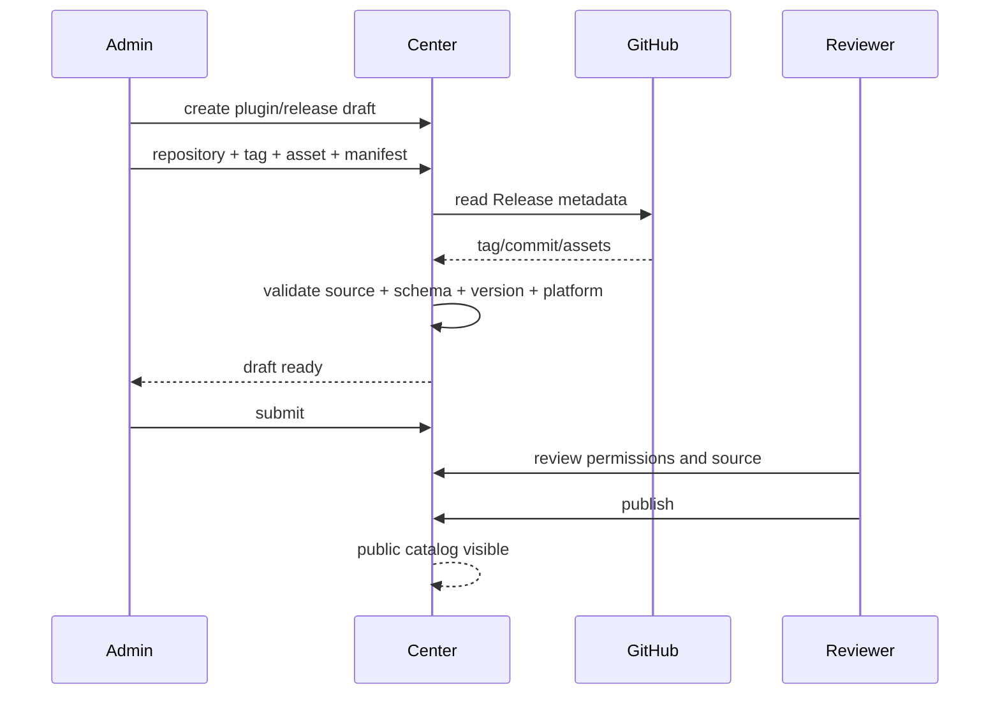
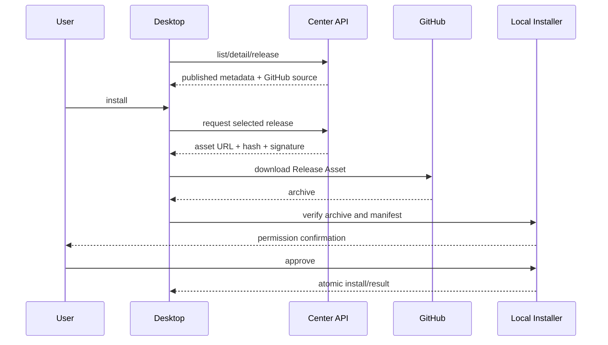

# 插件中心技术架构设计

版本：0.8
状态：V1 GitHub Releases 分发方案，管理端来源复核、审计和基础 Worker 巡检已接入
更新时间：2026-09-05

## 1. 架构结论

V1 采用“Center 管目录，GitHub 管工件，Desktop 管安装”的分层：

- `dsh-center-plugin` 是独立内容平台，负责插件条目、版本元数据、Manifest、审核、发布、下架和审计。
- GitHub Releases 是 V1 唯一插件包来源，Release Asset 由插件发布者维护。
- Desktop 通过 Center API 获取已审核的安装声明，然后直接从 GitHub 下载 Asset。
- Desktop 本地 Installer 负责 SHA-256、签名、兼容性、归档安全、用户确认和原子安装。
- V1 不建设对象存储、不代理下载、不引入账号/许可证、不接入 Gateway 远程任务。

```text
┌──────────────────┐      catalog/read       ┌──────────────────────┐
│ Marketplace Web  │ ──────────────────────> │                      │
└──────────────────┘                         │  dsh-center-plugin   │
                                             │  Catalog/API/Admin   │
┌──────────────────┐  metadata + source      │                      │
│ Harness Desktop  │ <────────────────────── │  PostgreSQL + Redis  │
└────────┬─────────┘                         └──────────┬───────────┘
         │                                               │ GitHub API metadata
         │ direct Release Asset                           ▼
         └──────────────────────────────────────> GitHub Releases
```

## 2. 工程落点

插件中心工程固定为 `<dsh-center-plugin-repo>`，组织方式与 `dsh-sync-server` 对齐但运行隔离：

```text
dsh-center-plugin/
├── src/
│   ├── app.ts                    # 公共 Center API
│   ├── admin-app.ts              # Admin API + 静态管理台
│   ├── server.ts                 # 公共 API 入口
│   ├── admin-server.ts           # 管理端入口
│   ├── catalog.ts                # Catalog 合同和内存测试实现
│   ├── catalog-repository.ts     # PostgreSQL Catalog
│   ├── manifest.ts               # Manifest v1 校验
│   ├── github-provider.ts        # GitHub Release 适配器
│   ├── worker.ts                 # Release 状态检查/缓存维护
│   └── persistence/migrations/
├── contracts/
│   └── plugin-manifest.schema.json
├── apps/
│   ├── marketplace/              # 公共 Marketplace
│   └── center-admin/              # 内容管理端
├── tests/
└── deploy/
```

与 `dsh-sync-server` 的边界：

| 系统 | 责任 | 不负责 |
|---|---|---|
| `dsh-center-plugin` | 目录、GitHub 来源、审核、发布、公共 API | Session、设备连接、本地安装、远程任务 |
| `dsh-gui` | Desktop UI、下载、验签、Plugin Manager、Runtime 生命周期 | 内容审核、订单、组织策略 |
| `dsh-sync-server` | Gateway 同步、设备、任务和回执 | V1 插件市场 |

两套工程不直接 import 对方业务源码，不共用数据库、Redis key、认证密钥或管理员账号。

## 3. 组件设计

### 3.1 Center API

Center API 只返回已发布记录。主要职责：

- 查询公开目录、详情、版本和兼容性。
- 返回 GitHub Release 来源、Asset 名称、哈希、大小和签名。
- 隐藏草稿、审核中、下架和来源失效的版本。
- 为 Marketplace Web 和 Desktop 提供统一只读合同。

API 不将 GitHub Asset 转发给客户端，也不把 GitHub URL 伪装成 Center 短期下载 URL。

### 3.2 Center Admin

管理端负责内容写入和发布状态机：

```text
创建插件 → 登记 GitHub Release → 校验 Manifest/来源 → 提交审核
                                                        │
                         下架 <── published <── 审核通过
```

当前开发阶段使用 `x-center-admin-key`，生产必须替换为管理员登录会话、角色校验、审计 Actor 和幂等请求。

管理端前端按职责拆分为 `App`、API Client、领域类型和页面视图模块。`App` 只编排导航、连接状态、数据刷新和弹窗；API Client 统一注入管理请求头并把稳定错误码映射为中文；页面视图消费真实管理 API 数据，不保存独立假数据。管理密钥只进入当前浏览器会话存储，主动断开时清理；公开 Marketplace 不加载该模块，也没有管理入口。

当前五个视图共享插件和版本查询结果。内容总览和插件条目可直接聚合现有 API；版本深度审核、来源复检与审计查询需要新增结构化后端能力，不能通过前端推断替代。这样可以先交付 PC-016-A/C，同时保持 PC-016-D/E/F 的接口边界清晰。

版本登记使用 `004_release_verification.sql` 增加版本校验摘要字段；`005_audit_indexes.sql` 为时间、插件/版本和动作查询增加索引。Admin App 先完成 Manifest/签名/来源合同校验，再将每个结果以 `passed`、`warning` 或 `failed` 写入 Catalog；远程 GitHub 失败不会丢失管理记录，而是形成不可提交审核的失败草稿。历史版本通过 `reverify` 路由复用来源校验器，覆盖最新校验结果并追加 `plugin.release.reverified` 审计事件。Catalog 状态机在进入 `review` 或 `published` 前检查校验状态，审核退回通过 `review → draft` 并保存说明。公共 Catalog 通过投影类型剔除校验摘要和审核原因，避免管理数据进入 Marketplace/Desktop 合同。

### 3.3 GitHub Artifact Provider

GitHub Provider 将 Center 内部的来源合同解析为 GitHub API 和 Release Asset：

```ts
interface PluginArtifactProvider {
  getRelease(source: GithubReleaseSource): Promise<GithubReleaseMetadata>
  getAsset(source: GithubReleaseSource): Promise<GithubAssetMetadata>
  verifyRelease(source: GithubReleaseSource): Promise<VerificationResult>
}
```

V1 实现 `GithubArtifactProvider`，未来可增加 `ObjectStorageArtifactProvider` 或 `MirrorArtifactProvider`，不改变公共 API 和 Desktop 安装合同。

Provider 的 SSRF 防护：

- Repository 必须拆分保存为 `owner/repository`，不接受任意 URL。
- 只允许配置过的 GitHub 组织/仓库。
- Center 服务端只访问 GitHub API 和允许的 GitHub 下载域名。
- Desktop 只接受 Center 返回且与 Repository/Tag/Asset 匹配的地址。
- 不允许从 `main`、`master` 或任意分支读取可执行插件。

### 3.4 Desktop Installer

Desktop 安装链路：

```text
Center metadata
    → select platform asset
    → GitHub download to staging
    → hash/signature/manifest verification
    → permission confirmation
    → atomic install
    → health check / rollback
```

WebView 只展示内容和状态，不直接获得文件系统、shell、网络代理或通用 Tauri IPC 权限。所有本地动作通过固定的 `plugin-manager` Host API 完成。

当前 Desktop 已落地 `apps/desktop/src-tauri/src/plugin_center.rs`。它通过 `HARNDOCK_PLUGIN_CENTER_URL` 访问 Center 目录、详情和下载声明接口，并通过 `HARNDOCK_PLUGIN_HTTP_PROXY` 下载 GitHub Release Asset；两项配置在 `apps/desktop/.env` 中提供，构建时嵌入正式包，启动时同名系统环境变量可覆盖。未配置 Center 地址时，客户端会返回明确的配置错误；未配置代理时则直连 GitHub。固定命令包括目录/详情、下载、安装预检、安装提交、已安装清单、手动回滚、启用、禁用和卸载；WebView 只提交 `pluginId/version/taskId`，不能传入任意 URL 或本地路径。模块会校验 Center 响应、repository/tag/asset URL、最终重定向域名、体积和 SHA-256。安装预检验证 Ed25519 签名、平台、Runtime API、Harness 版本和归档结构，并将已验证 Manifest 的权限交给用户确认；提交后通过版本存储原子更新 `current.json`，状态为 `pending`，清单读取当前指针、健康和启用状态。

插件归档预检和版本存储位于 `apps/desktop/src-tauri/src/plugin_installer.rs`。GitHub Release 中的 tar.zst 与 `plugin-manifest.json` 是两个独立 Asset；归档只包含 `harndock-plugin/` 根目录，并在根目录提供 `package.json`。安装器在解压前完成索引扫描，验证归档根目录、重复路径、文件类型、符号链接目标、Manifest 元数据、目标平台、Runtime API 和 Harness 版本范围。预检通过后解压至 `plugins/install-staging`，二次检查实际文件树，再原子移动至 `plugins/installed/{pluginId}/versions/{version}` 并更新 `current.json`；旧版本继续保留用于回滚。

Desktop 页面入口已接入现有启动外壳的 `Plugin Center` 切换按钮和 File 菜单。Marketplace 使用 `harndock://plugins/{pluginId}` 唤起客户端；Tauri 只注册 `harndock` scheme，Rust 和前端都验证固定 `plugins` host、单段 Plugin ID、无凭据/端口/查询/片段，并将合法目标转换为内部 `tauri://localhost?view=plugins&pluginId=...`。Windows/Linux 通过 single-instance deep-link 集成把链接交给现有进程，macOS 由 bundle `CFBundleURLTypes` 注册协议。深链冷启动保持插件中心优先，不让已配对 Runtime 自动导航覆盖安装页面；离开插件中心后才根据 Runtime 状态恢复或启动 Harness。

目录页和详情弹层通过固定 Tauri 命令获取 Center 公开数据，下载状态由 Rust 任务驱动，页面不接触 GitHub URL 和本地路径。下载完成后进入“声明 → 完整性 → 签名 → 兼容性/归档 → 原子安装 → Runtime Loader 健康确认”流程。当前原子安装、已安装清单、手动回滚、生产 profile 加载、ready 后健康确认和插件生命周期管理已接通；生命周期变更要求 Runtime 停止，并通过 `plugin://health` 通知前端刷新状态。下一阶段补 Runtime 运行期间健康事件以及热启停。

## 4. 数据模型

V1 核心表：

```text
plugins
  plugin_id, name, slug, author, category, summary, description, icon_url
  status, created_at, updated_at

plugin_releases
  plugin_id, version, status
  plugin_types, permissions, harness_min_version, runtime_api, platforms
  github_repository, github_release_tag, github_release_id
  github_commit_sha, github_asset_name, github_manifest_asset_name
  sha256, artifact_size, signature_key_id, signature_value
  verification_status, verification_checked_at, verification_checks
  verification_error_code, review_note
  source_status, source_checked_at, source_error_code, source_failure_count
  source_etag, source_release_id
  created_at, published_at

content_audit_events
  event_id, action, plugin_id, version, actor_id, metadata, created_at
```

关键约束：

- `plugin_id + version` 唯一，发布后不可覆盖。
- `github_repository + github_release_tag + github_asset_name` 必须能定位一个 Release Asset。
- `github_commit_sha` 在发布时固定，用于检测 Tag 漂移。
- `sha256` 和签名是安装校验材料，不以 GitHub URL 作为安全证明。
- Center 不保存 Asset 二进制，不建立 `artifacts` 对象存储表。
- V2 的 `accounts`、`entitlements`、`orders`、`organizations`、`install_tasks` 不进入 V1 数据库。
- `verification_checks` 仅供管理端使用；公共查询通过 `PublicPluginRelease` 投影剔除校验和审核字段。
- 审计查询只返回业务操作元数据，不返回管理员密钥、数据库连接串或 GitHub 凭据。
- Worker 的来源巡检复用 Admin 的 GitHub 校验器，写入 `source_*` 字段和 `plugin.release.reverified` 事件；重复巡检携带 `If-None-Match`，Release 返回 304 时复用最近一次通过的校验并重新确认固定 commit；GitHub 403/429 使用有限指数退避，单轮限流后停止剩余来源请求。巡检失败不自动改变 `published/unpublished`，避免把远程短时故障变成不可逆的内容操作。
- `source_status=failed` 的发布版本只在管理端保留，不进入公共插件列表、详情和下载候选；来源完整复核恢复后重新可见，Desktop 已安装版本不受该公共候选过滤影响。
- `source_sweep_runs` 持久化 Worker 每轮的检查、成功率、未修改、限流、漂移、延迟和耗时指标，管理端可通过 `/v1/admin/source-sweeps` 查询最近运行结果。
- Worker 可通过 `SOURCE_SWEEP_ALERT_WEBHOOK_URL` 发送状态切换告警；正常到异常发送 `source_sweep_anomaly`，异常恢复发送 `source_sweep_recovery`，连续同状态不重复通知，通知失败不阻断巡检。
- Marketplace 静态构建使用 `VITE_PUBLIC_CENTER_API_ORIGIN` 指向公开 Center API；Compose 由 `PUBLIC_CENTER_API_ORIGIN` 注入构建参数。该页面不使用管理 API，也不携带管理员密钥。

## 5. 发布与安装时序

### 5.1 发布



Center 可以在审核阶段临时下载文件计算哈希，但下载内容只进入临时目录并在验证后删除；V1 不要求对象存储。

### 5.2 Desktop 安装



## 6. 一致性与失效策略

GitHub Release 不是绝对不可变资源，管理员可以删除 Asset、移动 Tag 或重新上传同名文件。因此发布时必须记录：

- Release Tag。
- Release commit SHA。
- Asset 文件名。
- Asset SHA-256 和大小。
- Manifest 版本和签名。

Worker 后续负责周期性检查 GitHub 来源：

| 情况 | Center 行为 | Desktop 行为 |
|---|---|---|
| Release 正常 | 保持 published | 可安装/更新 |
| Asset 被删除 | 标记 source unavailable，停止新安装 | 安装失败并提示来源不可用 |
| Tag/commit 漂移 | 进入异常待复核，不自动接受新内容 | 仍按原哈希校验，异常即拒绝 |
| GitHub 暂时限流 | 保留最后一次已审核元数据 | 允许已知版本重试下载，不扩大来源范围 |
| Center 不可用 | 不影响已安装插件 | 新安装失败，保留本地插件 |
| GitHub 不可用 | 目录仍可浏览 | 下载重试，不能跳过校验 |

## 7. 安全设计

### 7.1 信任边界

```text
GitHub / 用户输入 / Release Asset
              ↓ allowlist + schema + hash + signature
Center 发布记录
              ↓ public read contract
Desktop staging
              ↓ archive safety + local confirmation
Local Plugin Manager / Harness Runtime
```

### 7.2 必须实现

- HTTPS、SHA-256、签名三者同时保留。
- 版本和来源不可覆盖，内容变化必须重新审核。
- 拒绝任意 URL、任意仓库和分支源码安装。
- 下载使用 staging，校验完成后原子切换 active 版本。
- 解压时拒绝路径穿越、绝对路径、重复路径、设备文件、FIFO、硬链接和逃逸符号链接。
- Host plugin 按本机可执行代码展示高风险提示。
- Center 和 Desktop 日志脱敏 token、cookie、环境变量和用户内容。
- GitHub Token 不进入 Desktop；V1 不支持私有仓库。

## 8. 部署与可用性

`dsh-center-plugin` 继续采用与 `dsh-sync-server` 相同的多入口部署：

```text
center-api  : 公共 API
admin       : 管理 API + Marketplace/Admin 静态资源
worker      : GitHub 来源检查、缓存维护、审计补偿
migrate     : PostgreSQL 编号迁移
postgres    : Center 独立数据库
redis       : Center 缓存/任务命名空间
```

V1 不部署对象存储。公共 API 可以缓存 Catalog 元数据，但不缓存安装包；Desktop 下载流量直接走 GitHub。

生产环境需要额外关注：

- GitHub API 限流与重试。
- GitHub 在目标用户网络环境中的可达性。
- 公开 Release 删除或 Tag 漂移。
- Center 数据库备份和审计恢复。
- 未来增加镜像/CDN 时不改变 `PluginArtifactProvider` 接口。

## 9. 架构决策记录

| 决策 | 结论 | 原因 |
|---|---|---|
| V1 工件来源 | 公开 GitHub Releases Asset | 降低首版基础设施成本 |
| Center 是否存工件 | 否 | Center 只维护内容和发布元数据 |
| Center 是否代理下载 | 否 | 避免带宽、缓存和大文件运维复杂度 |
| Desktop 是否直接访问 GitHub | 是，但必须先获取 Center 安装声明 | 保留审核状态和本地安全校验 |
| V1 是否支持私有仓库 | 否 | 暂不引入 GitHub OAuth/Token 与商业授权 |
| V1 是否嵌入 Gateway | 否 | Gateway 只在 V2 承担组织策略和远程任务 |
| 未来对象存储如何接入 | 新增 ArtifactProvider 实现 | 不破坏 V1 API、Manifest 和安装器 |
