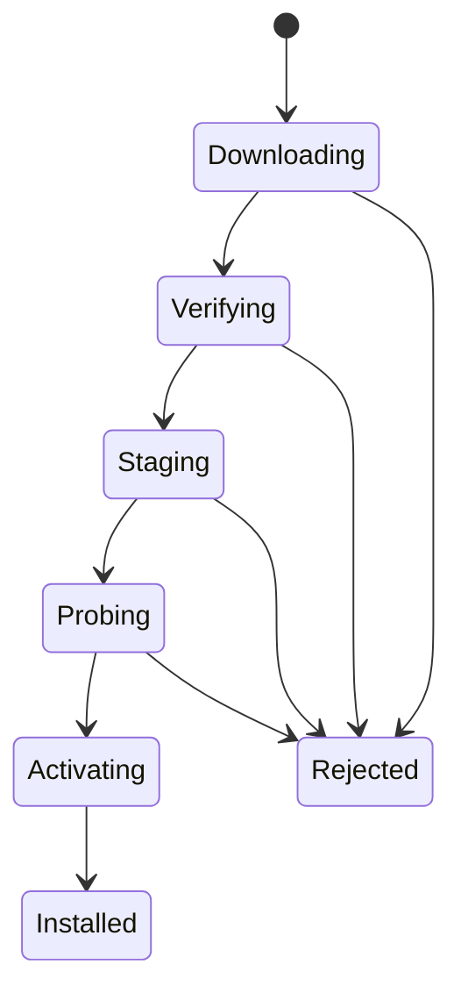

# Harness Runtime 管理

## 目标

Runtime 管理层让 Tauri 壳与 DeepSeek Harness 独立演进，同时保证任意一次更新都可验证、可拒绝，并在未写入不兼容用户数据时可回滚。

Runtime 包含固定 Node 版本、构建后的 `dsh` CLI、Web 资源、生产依赖、内置 bundle 和平台原生依赖。上游源码 checkout、测试缓存和开发依赖不进入 Runtime artifact。

## 构建输入

`runtime/harness.lock.json` 固定构建来源。建议格式：

```json
{
  "repository": "https://github.com/deepseek-ai/deepseek-harness.git",
  "commit": "cd5ef8148158c3a752a658978873241fdf8e2bbc",
  "upstreamVersion": "0.1.2-alpha.1",
  "node": "22.22.3",
  "runtimeApi": 1
}
```

submodule commit 与 lock 文件必须一致，CI 对不一致状态直接失败。`runtimeApi` 是 harndock Runtime Manager 与 artifact 启动布局之间的版本，不是 Harness Client/Host RPC 版本。

## Runtime artifact 契约

机器契约位于 [`runtime/manifest.schema.json`](../runtime/manifest.schema.json)，完整布局和安全规则位于 [`runtime/README.md`](../runtime/README.md)。P3 首发目标固定为 `darwin-aarch64`，每份 artifact 是单根目录的 `tar.zst`：

```text
harndock-runtime/
├── runtime-manifest.json
├── manifest.schema.json
├── control-protocol.schema.json
├── bin/node
├── tools/pnpm/bin/pnpm.cjs
├── app/node_modules/@deepseek-ai/dsh/lib/bin.js
├── plugins/{desktop-bundle,client-desktop,runtime-bridge}/
└── licenses/
```

Node 固定为 `22.22.3`；pnpm 固定为 `11.9.0`，并由内置 Node 执行。这样 profile 初始化和插件管理也不依赖用户预装工具。archive 构建必须可复现并保留可执行位与内部相对符号链接；安装前先验证相邻 SHA-256，再检查单根目录、路径穿越、链接逃逸和 manifest。

manifest v1 使用 `YYYY.MM.DD.N` Runtime 版本、`runtimeApi: 1` 和半开 Shell 兼容区间。当前 Shell `0.1.0` 只接受 manifest v1、Runtime API 1、匹配平台及 `[0.1.0, 0.2.0)`。未知 API 不做猜测性启动。

## 签名发布清单（P4）

P4 中每个平台 artifact 再配套一个外部签名清单：

```json
{
  "channel": "stable",
  "runtimeVersion": "2026.08.16.1",
  "harnessCommit": "cd5ef8148158c3a752a658978873241fdf8e2bbc",
  "platform": "darwin-aarch64",
  "runtimeApi": 1,
  "minShellVersion": "0.1.0",
  "url": "https://example.invalid/runtime.tar.zst",
  "sha256": "<64 lowercase hex characters>",
  "size": 0
}
```

发布系统对外部清单签名。客户端不能仅信任 HTTPS、内部 manifest 或 `.sha256` 文件；下载内容必须同时满足签名、长度和 SHA-256 校验。

## 用户设备目录

```text
Application Data/harndock/
├── runtime/
│   ├── current.json
│   ├── versions/
│   │   ├── <runtime-version>/
│   │   └── <previous-version>/
│   ├── staging/
│   └── downloads/
├── harness-home/                 # 作为 DSH_HOME
│   ├── profiles/
│   ├── sessions/
│   └── settings.yaml
└── logs/
    ├── shell.log
    └── runtime.log
```

`current.json` 只保存当前 Runtime 版本和最近一次健康启动结果。切换时先把完整 artifact 安装到版本目录，再原子替换指针。绝不能在当前版本目录上原地覆盖文件。

## 安装状态机



探测至少包括：

1. artifact 清单与当前平台匹配；
2. Node 和 dsh 入口存在且可执行；
3. `dsh --version` 成功；
4. desktop profile 可以解析；
5. 使用临时 `DSH_HOME` 启动 `--port 0` 后能到达就绪状态；
6. 终止探测进程后端口和子进程均被释放。

探测使用临时数据目录，不能让候选 Runtime 在激活前修改用户的真实 `DSH_HOME`。

当前 Rust 安装器先读取相邻 `.sha256` 并流式计算 SHA-256，再遍历 `tar.zst` 的全部归档项，拒绝路径穿越、重复路径、硬链接、设备、FIFO 和越界符号链接。安全预检通过后解压到 `runtime/staging/install-<process>-<nonce>/`，校验完整 manifest 和产品包身份，使用 artifact 内置 Node 执行 Node、pnpm、Harness `--version` 自检，最后把单一 `harndock-runtime/` 根目录原子移动到 `runtime/versions/<runtimeVersion>/` 并写入 `pending` 指针。自检失败或中途退出只清理 staging，不触碰当前 Runtime。

首个 Runtime 通过 `runtime/bundled-runtime.json` 描述，并由 `apps/desktop/src-tauri/tauri.release.conf.json` 固定映射到 Tauri `$RESOURCES/runtime/`。基础 Tauri 配置不引用本地 artifact，因此源码检查不要求先构建 Runtime；正式 `pnpm build` 显式合并 release 配置，缺少归档时拒绝打包。`ProductionRuntimeConfig` 发现没有 `current.json` 时读取该 descriptor，校验目标平台和归档命名后调用同一安装器；已有 current Runtime 不会被 bundled artifact 覆盖。打包前由 `pnpm check:bundled-runtime` 校验 descriptor、manifest example、archive、SHA-256 和 release 资源映射；Tauri 的 `beforeBuildCommand` 会自动执行该检查。

## 启动与就绪

P1/P2 开发源码模式读取受管进程 stdout 中的稳定就绪行：

```text
dsh web: http://127.0.0.1:<port>/?token=<one-time-launch-token>
```

Harness 仅在 Web Server 已绑定且 Loader 树完成 settlement 后输出该行。Runtime Manager 仍需设置启动超时，并把超时、提前退出和输出流关闭区分为不同错误。

生产协议 v1 改用应用数据目录私有 `runtime/control/` 下的 Unix socket。Shell 创建 socket 和 256-bit nonce，通过环境变量交给 `@harndock/runtime-bridge`；bridge 注入 `webServer` 和 `connection`、等待 Loader settlement，再发送一条不超过 8 KiB 的 NDJSON `ready` 帧。Shell 按 [`runtime/control-protocol.schema.json`](../runtime/control-protocol.schema.json) 验证 nonce、版本、profile、Harness commit、干净的 `127.0.0.1` URL 与同源一次性认证 URL，并用认证 URL 在内嵌 WebView 中建立会话。生产模式在 ready 前遇到超时、EOF、多帧或 schema 错误时直接启动失败，不回退到 stdout 文案，也不自动打开系统浏览器。

当前实现中，debug 构建默认使用源码开发适配器；release 构建默认读取 `runtime/current.json`，解析 artifact manifest，使用 Runtime 内置 `bin/node` 和 `app/node_modules/@deepseek-ai/dsh/lib/bin.js` 启动。生产启动创建 `runtime/control/control.sock` 和每次启动独立的 256-bit nonce，通过 `HARNDOCK_CONTROL_*` 环境变量交给 bridge；Rust 端逐连接接受最大 8 KiB 的严格帧，先用 `ready` 导航到 Runtime，随后只接受 metadata 完整匹配的 `showSettings` 固定动作。Harness 浏览器入口通过同源固定 POST 请求 host bridge 发送该动作，不获得 nonce 或通用 Tauri IPC。listener 随 Runtime 生命周期关闭。开发调试可用 `HARNDOCK_RUNTIME_MODE=development` 或 `production` 显式覆盖默认 profile。

## 进程所有权

Runtime 进程必须是 Tauri 应用拥有的子进程，Rust 端保留唯一句柄。关闭流程为：

1. 状态切换到 `stopping`，拒绝新启动和更新；
2. 请求 Harness 正常退出；
3. 等待有上限的清理时间；
4. 超时后终止进程树；
5. 确认 stdout/stderr reader 和退出 watcher 全部收敛；
6. 发布 `stopped`。

P1 开发态在 Rust 与 Harness 之间使用最小 Node 监护适配器。适配器每 500 ms 检查 Tauri 父 PID，并在父进程消失时向 Harness 转发 `SIGTERM`，超时后升级为 `SIGKILL`；Rust 仍拥有适配器进程组和唯一控制句柄。该机制覆盖 Tauri 开发构建器强制替换宿主的路径，连续十次真实启动关闭测试未留下 Runtime 进程或端口。

生产环境仍需平台专项的孤儿治理和进程身份校验。启动新实例前不能只按历史 PID 盲目终止进程；P3 应使用受签名 Runtime 路径、进程创建时间或本机控制通道共同确认身份。

## 更新通道

| 通道 | 来源 | 默认自动安装 | 数据策略 |
|---|---|---|---|
| stable | 经过验证的 harndock Runtime release | 可开启 | 必须通过兼容性检查 |
| beta | 候选 release | 手动确认 | 更新前快照 |
| nightly | 指定 Harness master commit | 禁止 | 独立或可丢弃数据目录 |

用户端不执行 `git pull`、`pnpm install` 或源码构建。上游跟踪发生在 CI：发现新 commit，更新 submodule 与 lock，构建各平台 artifact，运行集成测试，然后发布候选清单。

## 回滚规则

默认保留当前和上一个健康版本。下列情况在新版本写入真实用户数据前允许自动回滚：

- Runtime 无法执行；
- profile 无法加载；
- 就绪超时；
- WebView 首次健康检查失败；
- Runtime 在健康观察窗口内退出。

Harness 当前仍处于预发布阶段，Session 和 SQLite 格式可能不提供迁移。如果新 Runtime 已经写入不兼容格式，切回旧 Runtime 未必能读取这些数据。因此更新前需要数据备份，且清单必须表达数据兼容等级。没有明确兼容声明时，stable 通道不得静默自动升级。

## Profile 与第三方插件

用户 profile 和插件位于共享 `DSH_HOME`，不随 Runtime 删除。候选 Runtime 激活前应先用临时副本验证当前 desktop profile。

开发态首次启动会执行 `scripts/prepare-desktop-profile.mjs`。准备器通过 Harness CLI 安装 `@harndock/desktop-bundle` 与 `@harndock/client-desktop`，校验安装副本与当前构建产物的指纹，并维持 `base -> web-app -> desktop -> 第三方` 的 bundle 层顺序。产品包发生变化时会重新安装；没有变化时不会运行 pnpm。生产态执行相同 Harness 插件流程，但使用 artifact 内置 Node、pnpm 和产品包。

开发第三方 bundle 时使用 Harness 的插件命令，不直接编辑 `node_modules`：

```sh
dsh plugin --profile desktop add <package-or-file-spec>
dsh plugin --profile desktop remove <package-name>
```

下一次准备 desktop profile 时，第三方 bundle 仍保留在产品层之后。普通 Host/Client plugin 可以作为 profile dependency 存在而不加入 `dsh.profile.bundles`；只有声明 `dsh.bundle.patch` 的包才是配置层。

第三方 Host plugin 是本机可执行代码。Runtime 更新导致插件加载失败时，应保留原 Runtime 和 profile，并显示失败插件与日志位置；不能自动删除、升级或禁用插件。后续插件管理 UI 必须把安装、启用、配置和卸载作为可审计的独立操作。

## 日志与隐私

- `shell.log` 记录 Runtime 版本、状态转换、进程退出和更新结果。
- `runtime.log` 收集 Harness stdout/stderr，并进行大小和保留期轮转。
- 日志展示前过滤已知凭据字段，但不能把过滤当作允许输出秘密的理由。
- 诊断包默认不包含 `.env`、credentials、Session 内容或完整用户路径。
